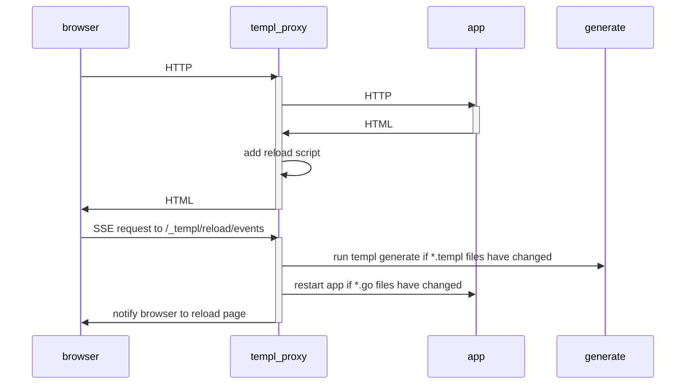
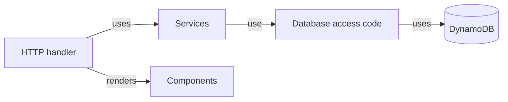
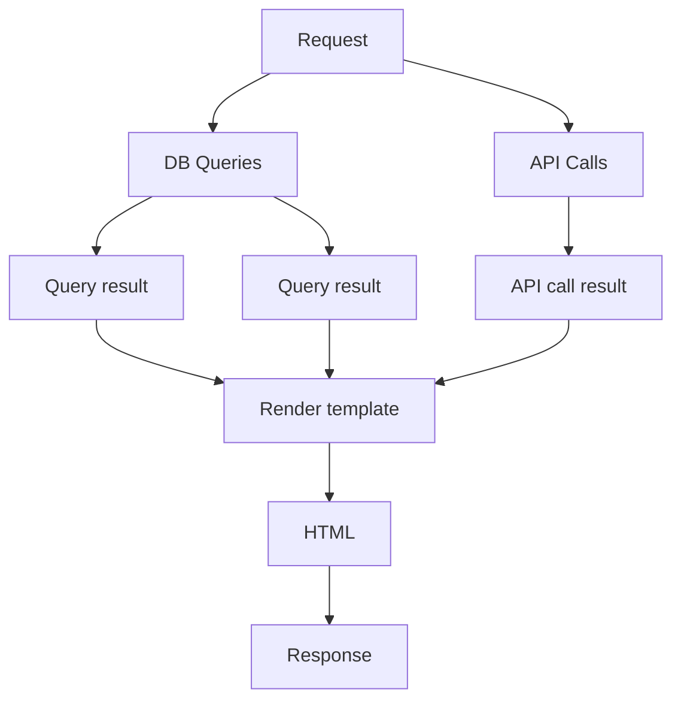
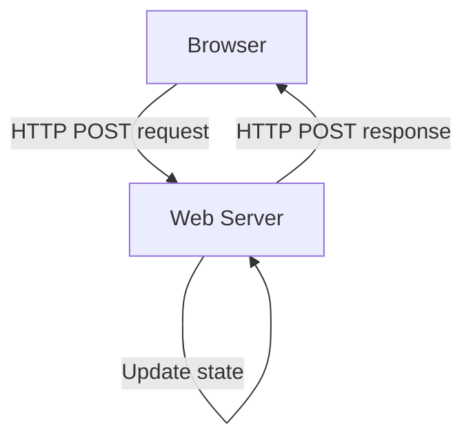
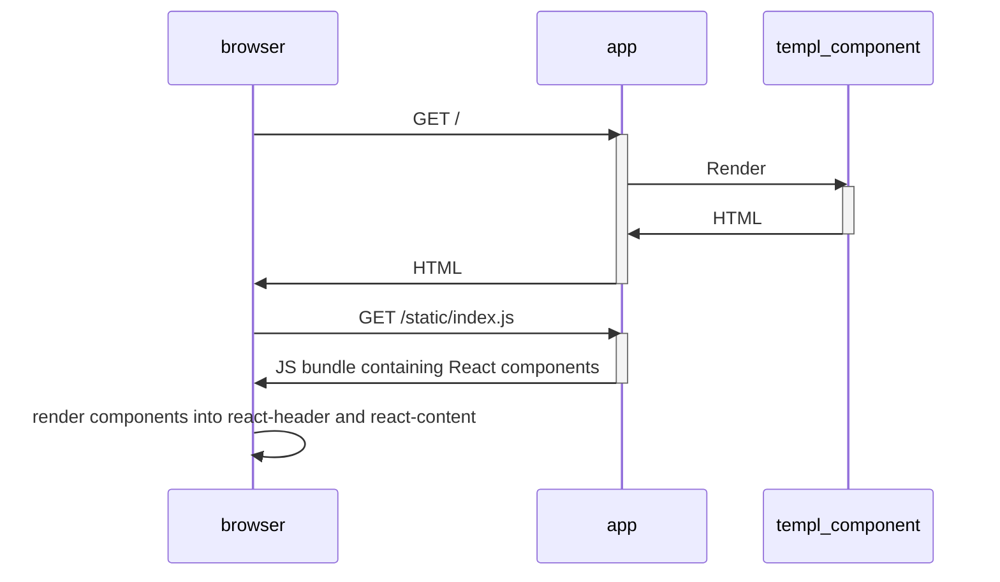
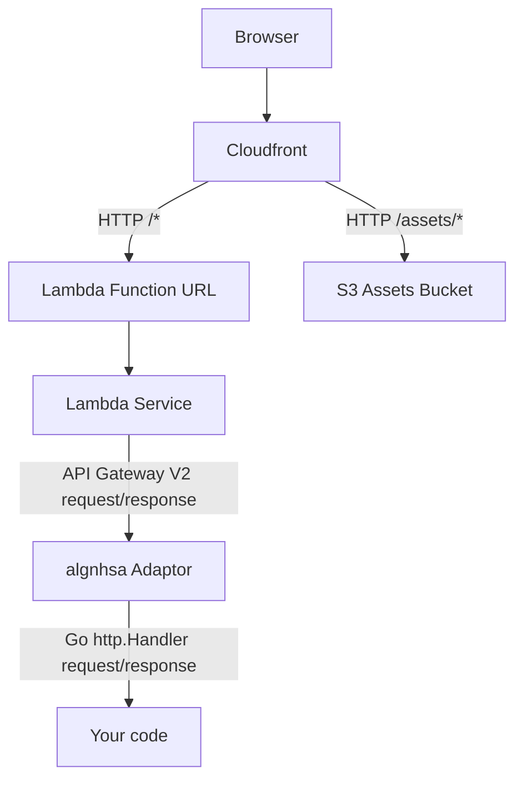

title: Using Templ with Go
tags: frontend, guide
prereq: golang, templ, htmx
---

# Template generation

To generate Go code from `*.templ` files, use the `templ` command line tool.

```
templ generate
```

The `templ generate` recurses into subdirectories and generates Go code for each `*.templ` file it finds.

The command outputs warnings, and a summary of updates.

```
(!) void element <input> should not have child content [ from=12:2 to=12:7 ]
(✓) Complete [ updates=62 duration=144.677334ms ]
```

## Advanced options

The `templ generate` command has a `--help` option that prints advanced options.

These include the ability to generate code for a single file and to choose the number of parallel workers that `templ generate` uses to create Go files.

By default `templ generate` uses the number of CPUs that your machine has installed.

```
templ generate --help
```

```
usage: templ generate [<args>...]

Generates Go code from templ files.

Args:
  -path <path>
    Generates code for all files in path. (default .)
  -f <file>
    Optionally generates code for a single file, e.g. -f header.templ
  -stdout
    Prints to stdout instead of writing generated files to the filesystem.
    Only applicable when -f is used.
  -source-map-visualisations
    Set to true to generate HTML files to visualise the templ code and its corresponding Go code.
  -include-version
    Set to false to skip inclusion of the templ version in the generated code. (default true)
  -include-timestamp
    Set to true to include the current time in the generated code.
  -watch
    Set to true to watch the path for changes and regenerate code.
  -cmd <cmd>
    Set the command to run after generating code.
  -proxy
    Set the URL to proxy after generating code and executing the command.
  -proxyport
    The port the proxy will listen on. (default 7331)
  -proxybind
    The address the proxy will listen on. (default 127.0.0.1)
  -notify-proxy
    If present, the command will issue a reload event to the proxy 127.0.0.1:7331, or use proxyport and proxybind to specify a different address.
  -w
    Number of workers to use when generating code. (default runtime.NumCPUs)
  -lazy
    Only generate .go files if the source .templ file is newer.	
  -pprof
    Port to run the pprof server on.
  -keep-orphaned-files
    Keeps orphaned generated templ files. (default false)
  -v
    Set log verbosity level to "debug". (default "info")
  -log-level
    Set log verbosity level. (default "info", options: "debug", "info", "warn", "error")
  -help
    Print help and exit.

Examples:

  Generate code for all files in the current directory and subdirectories:

    templ generate

  Generate code for a single file:

    templ generate -f header.templ

  Watch the current directory and subdirectories for changes and regenerate code:

    templ generate -watch
```

:::tip
The `templ generate --watch` option watches files for changes and runs templ generate when required.

However, the code generated in this mode is not optimised for production use.
:::
# View models

With templ, you can pass any Go type into your template as parameters, and you can call arbitrary functions.

However, if the parameters of your template don't closely map to what you're displaying to users, you may find yourself calling a lot of functions within your templ files to reshape or adjust data, or to carry out complex repeated string interpolation or URL constructions.

This can make template rendering hard to test, because you need to set up complex data structures in the right way in order to render the HTML. If the template calls APIs or accesses databases from within the templates, it's even harder to test, because then testing your templates becomes an integration test.

A more reliable approach can be to create a "View model" that only contains the fields that you intend to display, and where the data structure closely matches the structure of the visual layout.

```go
package invitesget

type Handler struct {
  Invites *InviteService
}

func (h Handler) ServeHTTP(w http.ResponseWriter, r *http.Request) {
  invites, err := h.Invites.Get(getUserIDFromContext(r.Context()))
  if err != nil {
     //TODO: Log error server side.
  }
  m := NewInviteComponentViewModel(invites, err)
  teamInviteComponent(m).Render(r.Context(), w)
}

func NewInviteComponentViewModel(invites []models.Invite, err error) (m InviteComponentViewModel) {
  m.InviteCount = len(invites)
  if err != nil {
    m.ErrorMessage = "Failed to load invites, please try again"
  }
  return m
}


type InviteComponentViewModel struct {
  InviteCount int
  ErrorMessage string
}

templ teamInviteComponent(model InviteComponentViewModel) {
	if model.InviteCount > 0 {
		<div>You have { fmt.Sprintf("%d", model.InviteCount) } pending invites</div>
	}
        if model.ErrorMessage != "" {
		<div class="error">{ model.ErrorMessage }</div>
        }
}
```
# Testing

To test that data is rendered as expected, there are two main ways to do it:

* Expectation testing - testing that specific expectations are met by the output.
* Snapshot testing - testing that outputs match a pre-written output.

## Expectation testing

Expectation testing validates that the right data appears in the output in the right format and position.

The example at https://github.com/a-h/templ/blob/main/examples/blog/posts_test.go shows how to test that a list of posts is rendered correctly.

These tests use the `goquery` library to parse HTML and check that expected elements are present. `goquery` is a jQuery-like library for Go, that is useful for parsing and querying HTML. You’ll need to run `go get github.com/PuerkitoBio/goquery` to add it to your `go.mod` file.

### Testing components

The test sets up a pipe to write templ's HTML output to, and reads the output from the pipe, parsing it with `goquery`.

First, we test the page header. To use `goquery` to inspect the output, we’ll need to connect the header component’s `Render` method to the `goquery.NewDocumentFromReader` function with an `io.Pipe`.

```go
func TestHeader(t *testing.T) {
    // Pipe the rendered template into goquery.
    r, w := io.Pipe()
    go func () {
        _ = headerTemplate("Posts").Render(context.Background(), w)
        _ = w.Close()
    }()
    doc, err := goquery.NewDocumentFromReader(r)
    if err != nil {
        t.Fatalf("failed to read template: %v", err)
    }
    // Expect the component to be present.
    if doc.Find(`[data-testid="headerTemplate"]`).Length() == 0 {
        t.Error("expected data-testid attribute to be rendered, but it wasn't")
    }
    // Expect the page name to be set correctly.
    expectedPageName := "Posts"
    if actualPageName := doc.Find("h1").Text(); actualPageName != expectedPageName {
        t.Errorf("expected page name %q, got %q", expectedPageName, actualPageName)
    }
}
```

The header template (the "subject under test") includes a placeholder for the page name, and a `data-testid` attribute that makes it easier to locate the `headerTemplate` within the HTML using a CSS selector of `[data-testid="headerTemplate"]`.

```go
templ headerTemplate(name string) {
    <header data-testid="headerTemplate">
        <h1>{ name }</h1>
    </header>
}
```

We can also test that the navigation bar was rendered.

```go
func TestNav(t *testing.T) {
    r, w := io.Pipe()
    go func() {
        _ = navTemplate().Render(context.Background(), w)
        _ = w.Close()
    }()
    doc, err := goquery.NewDocumentFromReader(r)
    if err != nil {
        t.Fatalf("failed to read template: %v", err)
    }
    // Expect the component to include a testid.
    if doc.Find(`[data-testid="navTemplate"]`).Length() == 0 {
        t.Error("expected data-testid attribute to be rendered, but it wasn't")
    }
}
```

Testing that it was rendered is useful, but it's even better to test that the navigation includes the correct `nav` items.

In this test, we find all of the `a` elements within the `nav` element, and check that they match the expected items.

```go
navItems := []string{"Home", "Posts"}

doc.Find("nav a").Each(func(i int, s *goquery.Selection) {
    expected := navItems[i]
    if actual := s.Text(); actual != expected {
        t.Errorf("expected nav item %q, got %q", expected, actual)
    }
})
```

To test the posts, we can use the same approach. We test that the posts are rendered correctly, and that the expected data is present.

### Testing whole pages

Next, we may want to go a level higher and test the entire page. 

Pages are also templ components, so the tests are structured in the same way.

There’s no need to test for the specifics about what gets rendered in the `navTemplate` or `homeTemplate` at the page level, because they’re already covered in other tests.

Some developers prefer to only test the external facing part of their code (e.g. at a page level), rather than testing each individual component, on the basis that it’s slower to make changes if the implementation is too tightly controlled.

For example, if a component is reused across pages, then it makes sense to test that in detail in its own test. In the pages or higher-order components that use it, there’s no point testing it again at that level, so we only check that it was rendered to the output by looking for its data-testid attribute, unless we also need to check what we're passing to it.

### Testing the HTTP handler

Finally, we want to test the posts HTTP handler. This requires a different approach.

We can use the `httptest` package to create a test server, and use the `net/http` package to make a request to the server and check the response.

The tests configure the `GetPosts` function on the `PostsHandler` with a mock that returns a "database error", while the other returns a list of two posts. Here's what the `PostsHandler` looks like:

```go
type PostsHandler struct {
    Log      *log.Logger
    GetPosts func() ([]Post, error)
}
```

In the error case, the test asserts that the error message was displayed, while in the success case, it checks that the `postsTemplate` is present. It does not check that the posts have actually been rendered properly or that specific fields are visible, because that’s already tested at the component level.

Testing it again here would make the code resistant to refactoring and rework, but then again, we might have missed actually passing the posts we got back from the database to the posts template, so it’s a matter of risk appetite vs refactor resistance.

Note the switch to the table-driven testing format, a popular approach in Go for testing multiple scenarios with the same test code.
```go
func TestPostsHandler(t *testing.T) {
    tests := []struct {
        name           string
        postGetter     func() (posts []Post, err error)
        expectedStatus int
        assert         func(doc *goquery.Document)
    }{
        {
            name: "database errors result in a 500 error",
            postGetter: func() (posts []Post, err error) {
                return nil, errors.New("database error")
            },
            expectedStatus: http.StatusInternalServerError,
            assert: func(doc *goquery.Document) {
                expected := "failed to retrieve posts\n"
                if actual := doc.Text(); actual != expected {
                    t.Errorf("expected error message %q, got %q", expected, actual)
                }
            },
        },
        {
            name: "database success renders the posts",
            postGetter: func() (posts []Post, err error) {
                return []Post{
                    {Name: "Name1", Author: "Author1"},
                    {Name: "Name2", Author: "Author2"},
                }, nil
            },
            expectedStatus: http.StatusInternalServerError,
            assert: func(doc *goquery.Document) {
                if doc.Find(`[data-testid="postsTemplate"]`).Length() == 0 {
                    t.Error("expected posts to be rendered, but it wasn't")
                }
            },
        },
    }
    for _, test := range tests {
        // Arrange.
        w := httptest.NewRecorder()
        r := httptest.NewRequest(http.MethodGet, "/posts", nil)

        ph := NewPostsHandler()
        ph.Log = log.New(io.Discard, "", 0) // Suppress logging.
        ph.GetPosts = test.postGetter

        // Act.
        ph.ServeHTTP(w, r)
        doc, err := goquery.NewDocumentFromReader(w.Result().Body)
        if err != nil {
            t.Fatalf("failed to read template: %v", err)
        }

        // Assert.
        test.assert(doc)
    }
}
```

### Summary

- goquery can be used effectively with templ for writing component level tests.
- Adding `data-testid` attributes to your code simplifies the test expressions you need to write to find elements within the output and makes your tests less brittle.
- Testing can be split between the two concerns of template rendering, and HTTP handlers.

## Snapshot testing

Snapshot testing is a more broad check. It simply checks that the output hasn't changed since the last time you took a copy of the output.

It relies on manually checking the output to make sure it's correct, and then "locking it in" by using the snapshot.

templ uses this strategy to check for regressions in behaviour between releases, as per https://github.com/a-h/templ/blob/main/generator/test-html-comment/render_test.go

To make it easier to compare the output against the expected HTML, templ uses a HTML formatting library before executing the diff.

```go
package testcomment

import (
	_ "embed"
	"testing"

	"github.com/a-h/templ/generator/htmldiff"
)

//go:embed expected.html
var expected string

func Test(t *testing.T) {
	component := render("sample content")

	diff, err := htmldiff.Diff(component, expected)
	if err != nil {
		t.Fatal(err)
	}
	if diff != "" {
		t.Error(diff)
	}
}
```
# Components

templ Components are markup and code that is compiled into functions that return a `templ.Component` interface by running the `templ generate` command.

Components can contain templ elements that render HTML, text, expressions that output text or include other templates, and branching statements such as `if` and `switch`, and `for` loops.

```templ title="header.templ"
package main

templ headerTemplate(name string) {
  <header data-testid="headerTemplate">
    <h1>{ name }</h1>
  </header>
}
```

The generated code is a Go function that returns a `templ.Component`.

```go title="header_templ.go"
func headerTemplate(name string) templ.Component {
  // Generated contents
}
```

`templ.Component` is an interface that has a `Render` method on it that is used to render the component to an `io.Writer`.

```go
type Component interface {
	Render(ctx context.Context, w io.Writer) error
}
```

:::tip
Since templ produces Go code, you can share templates the same way that you share Go code - by sharing your Go module.

templ follows the same rules as Go. If a `templ` block starts with an uppercase letter, then it is public, otherwise, it is private.

A `templ.Component` may write partial output to the `io.Writer` if it returns an error. If you want to ensure you only get complete output or nothing, write to a buffer first and then write the buffer to an `io.Writer`.
:::

## Code-only components

Since templ Components ultimately implement the `templ.Component` interface, any code that implements the interface can be used in place of a templ component generated from a `*.templ` file.

```go
package main

import (
	"context"
	"io"
	"os"

	"github.com/a-h/templ"
)

func button(text string) templ.Component {
	return templ.ComponentFunc(func(ctx context.Context, w io.Writer) error {
		_, err := io.WriteString(w, "<button>"+text+"</button>")
		return err
	})
}

func main() {
	button("Click me").Render(context.Background(), os.Stdout)
}
```

```html title="Output"
<button>
 Click me
</button>
```

:::warning
This code is unsafe! In code-only components, you're responsible for escaping the HTML content yourself, e.g. with the `templ.EscapeString` function.
:::

## Method components

templ components can be returned from methods (functions attached to types).

Go code:

```templ
package main

import "os"

type Data struct {
	message string
}

templ (d Data) Method() {
	<div>{ d.message }</div>
}

func main() {
	d := Data{
		message: "You can implement methods on a type.",
	}
	d.Method().Render(context.Background(), os.Stdout)
}
```

It is also possible to initialize a struct and call its component method inline.

```templ
package main

import "os"

type Data struct {
	message string
}

templ (d Data) Method() {
	<div>{ d.message }</div>
}

templ Message() {
    <div>
        @Data{
            message: "You can implement methods on a type.",
        }.Method()
    </div>
}

func main() {
	Message().Render(context.Background(), os.Stdout)
}
```

# IDE support

## Visual Studio Code

There's a VS Code extension, just make sure you've already installed templ and that it's on your path.

- https://marketplace.visualstudio.com/items?itemName=a-h.templ
- https://github.com/a-h/templ-vscode

VSCodium users can find the extension on the Open VSX Registry at https://open-vsx.org/extension/a-h/templ

### Format on Save

Include the following into your settings.json to activate formatting `.templ` files on save with the
templ plugin:

```json
{
    "editor.formatOnSave": true,
    "[templ]": {
        "editor.defaultFormatter": "a-h.templ"
    },
}
```

### Tailwind CSS Intellisense

Include the following to the settings.json in order to enable autocompletion for Tailwind CSS in `.templ` files:

```json
{
  "tailwindCSS.includeLanguages": {
    "templ": "html"
  }
}
```
:::note 
Tailwind language servers require a tailwind.config.js file to be present in the root of your project. You can create a new config file with `npx tailwindcss init`, or use samples available at https://tailwindcss.com/docs/configuration
:::

### Emmet HTML completion

Include the following to the settings.json in order to get smooth HTML completion via emmet (such as expanding `input:button<Tab>` to `<input type="button" value="">`). The emmet plugin is built into vscode and just needs to be activated for `.templ` files:

```json
{
  "emmet.includeLanguages": {
    "templ": "html"
  }
}
```

## Neovim &gt; 0.5.0

A plugin written in VimScript which adds syntax highlighting: [joerdav/templ.vim](https://github.com/Joe-Davidson1802/templ.vim).

For neovim you can use [nvim-treesitter](https://github.com/nvim-treesitter/nvim-treesitter) and install [tree-sitter-templ](https://github.com/vrischmann/tree-sitter-templ) with `:TSInstall templ`.

The configuration for the templ Language Server is included in [lspconfig](https://github.com/neovim/nvim-lspconfig), [mason](https://github.com/williamboman/mason.nvim),
and [mason-lspconfig](https://github.com/williamboman/mason-lspconfig.nvim).

The `templ` command must be in your system path for the LSP to be able to start. Ensure that you can run it from the command line before continuing.

Installing and configuring the templ LSP is no different to setting up any other Language Server.

```lua
local lspconfig = require("lspconfig")

-- Use a loop to conveniently call 'setup' on multiple servers and
-- map buffer local keybindings when the language server attaches

local servers = { 'gopls', 'ccls', 'cmake', 'tsserver', 'templ' }
for _, lsp in ipairs(servers) do
  lspconfig[lsp].setup({
    on_attach = on_attach,
    capabilities = capabilities,
  })
end
```

In Neovim, you can use the `:LspInfo` command to check which Language Servers (if any) are running. If the expected language server has not started, it could be due to the unregistered templ file extension. 

To resolve this issue, add the following code to your configuration. This is also necessary for other LSPs to "pick up" on .templ files.

```lua
vim.filetype.add({ extension = { templ = "templ" } })
```

##### Other LSPs within .templ files

These LSPs can be used *in conjunction* with the templ lsp and tree-sitter. Here's how to set them up.

[html-lsp](https://github.com/neovim/nvim-lspconfig/blob/master/doc/configs.md#html) - First make sure you have it installed `:LspInstall html` or find it on the `:Mason` list. 

```lua
lspconfig.html.setup({
    on_attach = on_attach,
    capabilities = capabilities,
    filetypes = { "html", "templ" },
})
```

[htmx-lsp](https://github.com/neovim/nvim-lspconfig/blob/master/doc/configs.md#htmx) - First make sure you have it installed `:LspInstall htmx` or find it on the `:Mason` list. Note with this LSP, it activates after you type `hx-` in an html attribute, because that's how all htmx attributes are written.

```lua
lspconfig.htmx.setup({
    on_attach = on_attach,
    capabilities = capabilities,
    filetypes = { "html", "templ" },
})
```

[tailwindcss](https://github.com/neovim/nvim-lspconfig/blob/master/doc/configs.md#tailwindcss) - First make sure you have it installed `:LspInstall tailwindcss` or find it on the `:Mason` list.

```lua
lspconfig.tailwindcss.setup({
    on_attach = on_attach,
    capabilities = capabilities,
    filetypes = { "templ", "astro", "javascript", "typescript", "react" },
    settings = {
      tailwindCSS = {
        includeLanguages = {
          templ = "html",
        },
      },
    },
})
```

Inside of your `tailwind.config.js`, you need to tell tailwind to look inside of .templ files and/or .go files.

:::tip
If you don't have a `tailwind.config.js` in the root directory of your project, the Tailwind LSP won't activate, and you won't see autocompletion results.
:::

```js
module.exports = {
    content: [ "./**/*.html", "./**/*.templ", "./**/*.go", ],
    theme: { extend: {}, },
    plugins: [],
}
```

### Formatting

With the templ LSP installed and configured, you can use the following code snippet to format on save:


```lua
vim.api.nvim_create_autocmd({ "BufWritePre" }, { pattern = { "*.templ" }, callback = vim.lsp.buf.format })
```
`BufWritePre` means that the callback gets ran after you call `:write`.

If you have multiple LSPs attached to the same buffer, and you have issues with `vim.lsp.buf.format`, you can use this snippet to run `templ fmt` in the same way that you might from the command line.

This will get the buffer and its corresponding filename, and refresh the buffer after it has been formatted so you don't get out of sync issues.

```lua
local custom_format = function()
    if vim.bo.filetype == "templ" then
        local bufnr = vim.api.nvim_get_current_buf()
        local filename = vim.api.nvim_buf_get_name(bufnr)
        local cmd = "templ fmt " .. vim.fn.shellescape(filename)

        vim.fn.jobstart(cmd, {
            on_exit = function()
                -- Reload the buffer only if it's still the current buffer
                if vim.api.nvim_get_current_buf() == bufnr then
                    vim.cmd('e!')
                end
            end,
        })
    else
        vim.lsp.buf.format()
    end
end
```

To apply this `custom_format` in your neovim configuration as a keybinding, apply it to the `on_attach` function.

```lua
local on_attach = function(client, bufnr)
    local opts = { buffer = bufnr, remap = false }
    -- other configuration options
    vim.keymap.set("n", "<leader>lf", custom_format, opts)
end
```

To make this `custom_format` run on save, make the same autocmd from before and replace the callback with `custom_format`. 

```lua
vim.api.nvim_create_autocmd({ "BufWritePre" }, { pattern = { "*.templ" }, callback = custom_format })
```

You can also rewrite the function like so, given that the function will only be executed on .templ files.

```lua
local templ_format = function()
    local bufnr = vim.api.nvim_get_current_buf()
    local filename = vim.api.nvim_buf_get_name(bufnr)
    local cmd = "templ fmt " .. vim.fn.shellescape(filename)

    vim.fn.jobstart(cmd, {
        on_exit = function()
            -- Reload the buffer only if it's still the current buffer
            if vim.api.nvim_get_current_buf() == bufnr then
                vim.cmd('e!')
            end
        end,
    })
end
```

### Troubleshooting

If you cannot run `:TSInstall templ`, ensure you have an up-to-date version of [tree-sitter](https://github.com/nvim-treesitter/nvim-treesitter). The [package for templ](https://github.com/vrischmann/tree-sitter-templ) was [added to the main tree-sitter repositry](https://github.com/nvim-treesitter/nvim-treesitter/pull/5667) so you shouldn't need to install a separate plugin for it.

If you still don't get syntax highlighting after it's installed, try running `:TSBufEnable highlight`. If you find that you need to do this every time you open a .templ file, you can run this autocmd to do it for your neovim configuation.

```lua
vim.api.nvim_create_autocmd("BufEnter", { pattern = "*.templ", callback = function() vim.cmd("TSBufEnable highlight") end }) 
```

### Minimal Config

Minimal config with the following features (useful for debugging):
- [lazy-vim](https://github.com/folke/lazy.nvim): neovim package manager
- [lsp config](https://github.com/neovim/nvim-lspconfig)
    - templ-lsp
    - html-lsp
    - htmx-lsp
    - tailwind-lsp
- [cmp](https://github.com/hrsh7th/nvim-cmp): for autocompletion
- [tree-sitter](https://github.com/nvim-treesitter/nvim-treesitter): for synx highlighting
    - [tree sitter templ](https://github.com/vrischmann/tree-sitter-templ)

To use this config:

* As a permanent setup: Create/replace `init.lua` in your config folder (`~/.config/nvim/`)
* As a temporary setup: create a new folder in your `.config` (e.g.`~/.config/nvim_test`) and tell neovim to start up with that as the nvim appname `NVIM_APPNAME=nvim_test nvim` (see [neovim docs](https://neovim.io/doc/user/starting.html#%24NVIM_APPNAME) for further explanation.


```lua
local lazypath = vim.fn.stdpath("data") .. "/lazy/lazy.nvim"
if not vim.loop.fs_stat(lazypath) then
  vim.fn.system({
    "git",
    "clone",
    "--filter=blob:none",
    "https://github.com/folke/lazy.nvim.git",
    "--branch=stable", -- latest stable release
    lazypath,
  })
end
vim.opt.rtp:prepend(lazypath)
vim.g.mapleader = " " -- Make sure to set `mapleader` before lazy so your mappings are correct

require("lazy").setup({
  'neovim/nvim-lspconfig',
  {
    -- Autocompletion
    'hrsh7th/nvim-cmp',
    dependencies = {
      'hrsh7th/cmp-nvim-lsp',
    },
  },
  {
    -- Highlight, edit, and navigate code
    'nvim-treesitter/nvim-treesitter',
    dependencies = {
      'vrischmann/tree-sitter-templ',
    },
    build = ':TSUpdate',
  },
})

vim.filetype.add({ extension = { templ = "templ" } })

capabilities = require('cmp_nvim_lsp').default_capabilities(capabilities)
local lspconfig = require("lspconfig")

lspconfig.templ.setup{
  on_attach = on_attach,
  capabilities = capabilities,
}

lspconfig.tailwindcss.setup({
  on_attach = on_attach,
  capabilities = capabilities,
  filetypes = { "templ", "astro", "javascript", "typescript", "react" },
  init_options = { userLanguages = { templ = "html" } },
})

lspconfig.html.setup({
  on_attach = on_attach,
  capabilities = capabilities,
  filetypes = { "html", "templ" },
})

lspconfig.htmx.setup({
  on_attach = on_attach,
  capabilities = capabilities,
  filetypes = { "html", "templ" },
})

local cmp = require 'cmp'
cmp.setup({
  mapping = cmp.mapping.preset.insert({
    ['<C-b>'] = cmp.mapping.scroll_docs(-4),
    ['<C-f>'] = cmp.mapping.scroll_docs(4),
    ['<C-Space>'] = cmp.mapping.complete(),
    ['<C-e>'] = cmp.mapping.abort(),
    ['<CR>'] = cmp.mapping.confirm({ select = true }),
  }),
  sources = cmp.config.sources({
    { name = 'nvim_lsp' },
  })
})

require'nvim-treesitter.configs'.setup {
  ensure_installed = { "templ" },
  sync_install = false,
  auto_install = true,
  ignore_install = { "javascript" },
  highlight = {
    enable = true,
  },
}
```

## Vim

Currently support for vim is limited. Configure formatting with the following VimScript:

```vim
set autoread
autocmd BufWritePost *.templ silent! execute "!PATH=\"$PATH:$(go env GOPATH)/bin\" templ fmt <afile> >/dev/null 2>&1" | redraw!
```

## Helix

https://helix-editor.com/

Helix has built-in templ support in unstable since https://github.com/helix-editor/helix/pull/8540/commits/084628d3e0c29f4021f53b3e45997ae92033d2d2

It will be included in official releases after version 23.05.

## Emacs

[templ-ts-mode](https://github.com/danderson/templ-ts-mode) is a major mode for templ files that provides syntax highlighting, indentation, and the other usual major mode things. It is available on [MELPA](https://melpa.org/#/templ-ts-mode) and can be installed like any other Emacs package.

Templ support requires the [tree-sitter parser for Templ](https://github.com/vrischmann/tree-sitter-templ). If the parser is missing, the mode asks you on first use whether you want to download and build it via `treesit-install-language-grammar` (requires git and a C compiler).

## Troubleshooting

### Check that go, gopls and templ are installed and are present in the path

```shell
which go gopls templ
```

You should see 3 lines returned, showing the location of each binary:

```
/run/current-system/sw/bin/go
/Users/adrian/go/bin/gopls
/Users/adrian/bin/templ
```

### Check that you can run the templ binary

Run `templ lsp --help`, you should see help text.

* If you can't run the `templ` command at the command line:
  * Check that the `templ` binary is within a directory that's in your path (`echo $PATH` for Linux/Mac/WSL, `$env:path` for Powershell).
  * Update your profile to ensure that the change to your path applies to new shells and processes.
    * On MacOS / Linux, you may need to update your `~/.zsh_profile`, `~/.bash_profile` or `~/.profile` file.
    * On Windows, you will need to use the "Environment Variables" dialog. For WSL, use the Linux config.
  * On MacOS / Linux, check that the file is executable and resolve it with `chmod +x /path/to/templ`.
  * On MacOS, you might need to go through the steps at https://support.apple.com/en-gb/guide/mac-help/mh40616/mac to enable binaries from an "unidentified developer" to run.
* If you're running VS Code using Windows Subsystem for Linux (WSL), then templ must also be installed within the WSL environment, not just inside your Windows environment.
* If you're running VS Code in a Devcontainer, it must be installed in there.


### Enable LSP logging

For VS Code, use the "Preferences: Open User Settings (JSON)" command in VS Code and add the configuration options.

```js
{
    // More settings...
    "templ.log": "/Users/adrian/templ.log",
    "templ.goplsLog": "/Users/adrian/gopls.log",
    "templ.http": "localhost:7575",
    "templ.goplsRPCTrace": true,
    "templ.pprof": false,
    // More stuff...
}
```

For Neovim, configure the LSP command to add the additional command line options.

```lua
local configs = require('lspconfig.configs')
configs.templ = {
  default_config = {
    cmd = { "templ", "lsp", "-http=localhost:7474", "-log=/Users/adrian/templ.log" },
    filetypes = { 'templ' },
    root_dir = nvim_lsp.util.root_pattern("go.mod", ".git"),
    settings = {},
  },
}
```

For IntelliJ, configure the plugin settings `.idea/templ.xml`.

```xml
<?xml version="1.0" encoding="UTF-8"?>
<project version="4">
  <component name="TemplSettings">
    <option name="goplsLog" value="$USER_HOME$/gopls.log" />
    <option name="goplsRPCTrace" value="true" />
    <option name="http" value="localhost:7575" />
    <option name="log" value="$USER_HOME$/templ.log" />
  </component>
</project>
```

### Make a minimal reproduction, and include the logs

The logs can be quite verbose, since almost every keypress results in additional logging. If you're thinking about submitting an issue, please try and make a minimal reproduction.

### Look at the web server

The web server option provides an insight into the internal state of the language server. It may provide insight into what's going wrong.

### Run templ info

The `templ info` command outputs information that's useful for debugging issues.
# Live reload with other tools

Browser live reload allows you to see your changes immediately without having to switch to your browser and press `F5` or `CMD+R`.

However, Web projects usually involve multiple build processes, e.g. css bundling, js bundling, alongside templ code generation and Go compilation.

Tools like `air` can be used with templ's built-in proxy server to carry out additional steps.

## Example

This example, demonstrates setting up a live reload environment that integrates:

- [Tailwind CSS](https://tailwindcss.com/) for generating a css bundle.
- [esbuild](https://esbuild.github.io/) for bundling JavaScript or TypeScript.
- [air](https://github.com/cosmtrek/air) for re-building Go source as well as sending a reload event to the `templ` proxy server.

## How does it work

templ's built-in proxy server automatically refreshes the browser when a file changes. The proxy server injects a script that reloads the page in the browser if a "reload" event is sent to the browser by the proxy. See [Live Reload page](/developer-tools/live-reload) for a detailed explanation.

:::tip
The live reload JavaScript is only injected by the templ proxy if your HTML file contains a closing `</body>` tag.
:::

The "reload" event can be triggered in two ways:

- `templ generate --watch` sends the event whenever a ".templ" file changes.
- Manually trigger it by sending a HTTP POST request to `/_templ/reload/event` endpoint. The `templ` CLI provides this via `templ generate --notify-proxy`.

:::tip
templ proxy server `--watch` mode generates different `_templ.go` files. In `--watch` mode `_templ.txt` files are generated that contain just the text that's in templ files. This is used to skip compilation of the Go code when only the text content changes.
:::

## Setting up the Makefile

A `Makefile` can be used to run all of the necessary commands in parallel. This is useful for starting all of the watch processes at once.

### templ watch mode

To start the `templ` proxy server in watch mode, run:

```shell
templ generate --watch --proxy="http://localhost:8080" --open-browser=false
```

This assumes that your http server is running on `http://localhost:8080`. `--open-browser=false` is to prevent `templ` from opening the browser automatically.

### Tailwind CSS

Tailwind requires a `tailwind.config.js` file at the root of your project, alongside an `input.css` file.

```shell
npx --yes tailwindcss -i ./input.css -o ./assets/styles.css --minify --watch
```

This will watch `input.css` as well as your `.templ` files and re-generate `assets/styles.css` whenever there's a change.

### esbuild

To bundle JavaScript, TypeScript, JSX, or TSX files, you can use `esbuild`:

```shell
npx --yes esbuild js/index.ts --bundle --outdir=assets/ --watch
```

This will watch `js/index.ts` and relevant files, and re-generate `assets/index.js` whenever there's a change.

### Re-build Go source

To watch and restart your Go server, when only the `go` files change you can use `air`:

```shell
go run github.com/cosmtrek/air@v1.51.0 \
  --build.cmd "go build -o tmp/bin/main" --build.bin "tmp/bin/main" --build.delay "100" \
  --build.exclude_dir "node_modules" \
  --build.include_ext "go" \
  --build.stop_on_error "false" \
  --misc.clean_on_exit true
```

:::tip
Using `go run` directly allows the version of `air` to be specified. This ensures that the version of `air` is consistent between machines. In addition, you don't need to run `air init` to generate `.air.toml`.
:::

:::note
This command doesn't do anything to restart or send a reload event to the `templ` proxy server. We'll use a separate `air` command to trigger a notify event when any non-go related files change.
:::

### Reload event

We also want the browser to automatically reload when the:

1. HTML content changes
2. CSS bundle changes
3. JavaScript bundle changes

To trigger the event, we can use the `air` command to use a different set of options, using the `templ` CLI to send a reload event to the browser.

```shell
go run github.com/cosmtrek/air@v1.51.0 \
  --build.cmd "templ generate --notify-proxy" \
  --build.bin "true" \
  --build.delay "100" \
  --build.exclude_dir "" \
  --build.include_dir "assets" \
  --build.include_ext "js,css"
```

:::note
The `build.bin` option is set to use the `true` command instead of executing the output of the `build.cmd` option, because the `templ generate --notify-proxy` command doesn't build anything, it just sends a reload event to the `templ` proxy server.

`true` is a command that exits with a zero status code, so you might see `Process Exit with Code 0` printed to the console.
:::

### Serving static assets

When using live reload, static assets must be served directly from the filesystem instead of being embedded in the Go binary, because the Go binary won't be re-built when the assets change.

In practice this means using `http.Dir` instead of `http.FS` to serve your assets.

If you don't want to do this, you can add additional asset file extensions to the `--build.include_ext` argument of the `air` command that rebuilds Go code to force a recompilation and restart of the Go server when the assets change.

#### Before

```go
//go:embed assets/*
var assets embed.FS
...
mux.Handle("/assets/", http.FileServer(http.FS(assets)))
```

#### After

```go
mux.Handle("/assets/", 
  http.StripPrefix("/assets", 
    http.FileServer(http.Dir("assets"))))
```

:::tip
Web browsers will cache assets when they receive a HTTP 304 response. This will result in asset changes not being visible within your application.

To avoid this, set the `Cache-Control` header to `no-store` for assets in development mode:

```go
var dev = true

func disableCacheInDevMode(next http.Handler) http.Handler {
	if !dev {
		return next
	}
	return http.HandlerFunc(func(w http.ResponseWriter, r *http.Request) {
		w.Header().Set("Cache-Control", "no-store")
		next.ServeHTTP(w, r)
	})
}

mux.Handle("/assets/", 
  disableCacheInDevMode(
    http.StripPrefix("/assets", 
      http.FileServer(http.Dir("assets")))))
```
:::

## Putting it all together

A `Makefile` can be used to run all of the commands in parallel.

```make
# run templ generation in watch mode to detect all .templ files and 
# re-create _templ.txt files on change, then send reload event to browser. 
# Default url: http://localhost:7331
live/templ:
	templ generate --watch --proxy="http://localhost:8080" --open-browser=false -v

# run air to detect any go file changes to re-build and re-run the server.
live/server:
	go run github.com/cosmtrek/air@v1.51.0 \
	--build.cmd "go build -o tmp/bin/main" --build.bin "tmp/bin/main" --build.delay "100" \
	--build.exclude_dir "node_modules" \
	--build.include_ext "go" \
	--build.stop_on_error "false" \
	--misc.clean_on_exit true

# run tailwindcss to generate the styles.css bundle in watch mode.
live/tailwind:
	npx --yes tailwindcss -i ./input.css -o ./assets/styles.css --minify --watch

# run esbuild to generate the index.js bundle in watch mode.
live/esbuild:
	npx --yes esbuild js/index.ts --bundle --outdir=assets/ --watch

# watch for any js or css change in the assets/ folder, then reload the browser via templ proxy.
live/sync_assets:
	go run github.com/cosmtrek/air@v1.51.0 \
	--build.cmd "templ generate --notify-proxy" \
	--build.bin "true" \
	--build.delay "100" \
	--build.exclude_dir "" \
	--build.include_dir "assets" \
	--build.include_ext "js,css"

# start all 5 watch processes in parallel.
live: 
	make -j5 live/templ live/server live/tailwind live/esbuild live/sync_assets
```

:::note
The `-j5` argument to `make` runs all 5 commands in parallel.
:::

Run `make live` to start all of the watch processes.
# Coding assistants / LLMs

To provide AI coding assistants such as Github Copilot, Cursor or similar with help on how to write templ code, the templ project maintains a single file containing documentation for LLMs to read.

You can find the file at `https://templ.guide/llms.md`.

## LLM tools

### https://github.com/CopilotC-Nvim/CopilotChat.nvim

CopilotChat is a plugin for Neovim that provides a chat interface for Github Copilot. It allows you to ask Copilot questions and get responses in real-time.

Use the URL feature to load `https://templ.guide/llms.md`.
# Live reload

To access a Go web application that uses templ in a web browser, a few things must happen:

1. `templ generate` must be executed, to create Go code (`*_templ.go` files) from the `*.templ` files.
2. The Go code must start a web server on a port, e.g. (`http.ListenAndServe("localhost:8080", nil)`.
3. The Go program must be ran, e.g. by running `go run .`.
4. The web browser must access or reload the page, e.g. `http://localhost:8080`.

If the `*.templ` files change, #1 and #2 must be ran.

If the `*.go` files change, #3 and #4 must be ran.

## Built-in

`templ generate --watch` watches the current directory for changes and generates Go code if changes are detected.

`templ generate --watch` generates Go code that loads strings from a `_templ.txt` file on disk to reduce the number of times that Go code needs to be re-generated, and therefore reduces the number of time your app needs to be recompiled and restarted.

To re-run your app automatically, add the `--cmd` argument to `templ generate`, and templ will start or restart your app using the command provided once template code generation is complete (#3).

Finally, to trigger your web browser to reload automatically (without pressing F5), set the `--proxy` argument (#4).

The `--proxy` argument starts a HTTP proxy which proxies requests to your app. For example, if your app runs on port 8080, you would use `--proxy="http://localhost:8080"`. The proxy inserts client-side JavaScript before the `</body>` tag that will cause the browser to reload the window when the app is restarted instead of you having to reload the page manually. Note that the html being served by the webserver MUST have a `<body>` tag, otherwise there will be no javascript injection thus making the browser not reload automatically.

By default, the proxy binds to `127.0.0.1`. You can use `--proxybind` to bind to another address, e.g., `--proxybind="0.0.0.0"`.

Altogether, to setup live reload on an app that listens on port 8080, run the following.

```
templ generate --watch --proxy="http://localhost:8080" --cmd="go run ."
```

This will start the proxy server on port `7331` and open it in your default browser. If you'd like to prevent it from opening in your browser add the flag `--open-browser=false`.

```go title="main.go"
package main

import (
	"fmt"
	"net/http"

	"github.com/a-h/templ"
)

func main() {
	component := hello("World")

	http.Handle("/", templ.Handler(component))

	fmt.Println("Listening on :8080")
	http.ListenAndServe(":8080", nil)
}
```

```templ title="hello.templ"
package main

templ hello(name string) {
  <body>
	    <div>Hello, { name }</div>
  </body>
}
```

The live reload process can be shown in the following diagram:



### Triggering live reload from outside `templ generate --watch`

If you want to trigger a live reload from outside `templ generate --watch` (e.g. if you're using `air`, `wgo` or another tool to build, but you want to use the templ live reload proxy), you can use the `--notify-proxy` argument.

```shell
templ generate --notify-proxy
```

This will default to the default templ proxy address of `localhost:7331`, but can be changed with the `--proxybind` and `--proxyport` arguments.

```shell
templ generate --notify-proxy --proxybind="localhost" --proxyport="8080"
```

## Alternative 1: wgo

[wgo](https://github.com/bokwoon95/wgo):

> Live reload for Go apps. Watch arbitrary files and respond with arbitrary commands. Supports running multiple invocations in parallel.

```
wgo -file=.go -file=.templ -xfile=_templ.go templ generate :: go run main.go
```

To avoid a continous reloading files ending with `_templ.go` should be skipped via `-xfile`.

## Alternative 2: air

Air can handle `*.go` files, but doesn't ship with a proxy to automatically reload pages, and requires a `toml` configuration file for operation.

See https://github.com/cosmtrek/air for details.

### Example configuration

```toml title=".air.toml"
root = "."
tmp_dir = "tmp"

[build]
  bin = "./tmp/main"
  cmd = "templ generate && go build -o ./tmp/main ."
  delay = 1000
  exclude_dir = ["assets", "tmp", "vendor"]
  exclude_file = []
  exclude_regex = [".*_templ.go"]
  exclude_unchanged = false
  follow_symlink = false
  full_bin = ""
  include_dir = []
  include_ext = ["go", "tpl", "tmpl", "templ", "html"]
  kill_delay = "0s"
  log = "build-errors.log"
  send_interrupt = false
  stop_on_error = true

[color]
  app = ""
  build = "yellow"
  main = "magenta"
  runner = "green"
  watcher = "cyan"

[log]
  time = false

[misc]
  clean_on_exit = false
```
# CLI

`templ` provides a command line interface. Most users will only need to run the `templ generate` command to generate Go code from `*.templ` files.

```
usage: templ <command> [<args>...]

templ - build HTML UIs with Go

See docs at https://templ.guide

commands:
  generate   Generates Go code from templ files
  fmt        Formats templ files
  lsp        Starts a language server for templ files
  info       Displays information about the templ environment
  version    Prints the version
```

## Generating Go code from templ files

The `templ generate` command generates Go code from `*.templ` files in the current directory tree.

The command provides additional options:

```
usage: templ generate [<args>...]

Generates Go code from templ files.

Args:
  -path <path>
    Generates code for all files in path. (default .)
  -f <file>
    Optionally generates code for a single file, e.g. -f header.templ
  -source-map-visualisations
    Set to true to generate HTML files to visualise the templ code and its corresponding Go code.
  -include-version
    Set to false to skip inclusion of the templ version in the generated code. (default true)
  -include-timestamp
    Set to true to include the current time in the generated code.
  -watch
    Set to true to watch the path for changes and regenerate code.
  -cmd <cmd>
    Set the command to run after generating code.
  -proxy
    Set the URL to proxy after generating code and executing the command.
  -proxyport
    The port the proxy will listen on. (default 7331)
  -proxybind
    The address the proxy will listen on. (default 127.0.0.1)
  -w
    Number of workers to use when generating code. (default runtime.NumCPUs)
  -lazy
    Only generate .go files if the source .templ file is newer.	
  -pprof
    Port to run the pprof server on.
  -keep-orphaned-files
    Keeps orphaned generated templ files. (default false)
  -v
    Set log verbosity level to "debug". (default "info")
  -log-level
    Set log verbosity level. (default "info", options: "debug", "info", "warn", "error")
  -help
    Print help and exit.
```

For example, to generate code for a single file:

```
templ generate -f header.templ
```

## Formatting templ files

The `templ fmt` command formats template files. You can use this command in different ways:

1. Format all template files in the current directory and subdirectories:

```
templ fmt .
```

2. Format input from stdin and output to stdout:

```
templ fmt
```

Alternatively, you can run `fmt` in CI to ensure that invalidly formatted templatess do not pass CI. This will cause the command
to exit with unix error-code `1` if any templates needed to be modified.

```
templ fmt -fail .
```

## Language Server for IDE integration

`templ lsp` provides a Language Server Protocol (LSP) implementation to support IDE integrations.

This command isn't intended to be used directly by users, but is used by IDE integrations such as the VSCode extension and by Neovim support.

A number of additional options are provided to enable runtime logging and profiling tools.

```
  -goplsLog string
        The file to log gopls output, or leave empty to disable logging.
  -goplsRPCTrace
        Set gopls to log input and output messages.
  -help
        Print help and exit.
  -http string
        Enable http debug server by setting a listen address (e.g. localhost:7474)
  -log string
        The file to log templ LSP output to, or leave empty to disable logging.
  -pprof
        Enable pprof web server (default address is localhost:9999)
```
# Web frameworks

Templ is framework agnostic but that does not mean it can not be used with Go frameworks and other tools.

Below are some examples of how to use templ with other Go libraries, frameworks and tools, and links to systems that have built-in templ support.

### Chi

See an example of using https://github.com/go-chi/chi with templ at:

https://github.com/a-h/templ/tree/main/examples/integration-chi

### Echo

See an example of using https://echo.labstack.com/ with templ at:

https://github.com/a-h/templ/tree/main/examples/integration-echo

### Gin

See an example of using https://github.com/gin-gonic/gin with templ at:

https://github.com/a-h/templ/tree/main/examples/integration-gin

### Go Fiber

See an example of using https://github.com/gofiber/fiber with templ at:

https://github.com/a-h/templ/tree/main/examples/integration-gofiber

### github.com/gorilla/csrf

`gorilla/csrf` is a HTTP middleware library that provides cross-site request forgery (CSRF) protection.

Follow the instructions at https://github.com/gorilla/csrf to add it to your project, by using the library as HTTP middleware.

```go title="main.go"
package main

import (
  "crypto/rand"
  "fmt"
  "net/http"
  "github.com/gorilla/csrf"
)

func mustGenerateCSRFKey() (key []byte) {
  key = make([]byte, 32)
  n, err := rand.Read(key)
  if err != nil {
    panic(err)
  }
  if n != 32 {
    panic("unable to read 32 bytes for CSRF key")
  }
  return
}

func main() {
  r := http.NewServeMux()
  r.Handle("/", templ.Handler(Form()))

  csrfMiddleware := csrf.Protect(mustGenerateCSRFKey())
  withCSRFProtection := csrfMiddleware(r)

  fmt.Println("Listening on localhost:8000")
  http.ListenAndServe("localhost:8000", withCSRFProtection)
}
```

Creating a `CSRF` templ component makes it easy to include the CSRF token in your forms.

```templ title="form.templ"
templ Form() {
  <h1>CSRF Example</h1>
  <form method="post" action="/">
    @CSRF()
    <div>
      If you inspect the HTML form, you will see a hidden field with the value: { ctx.Value("gorilla.csrf.Token").(string) }
    </div>
    <input type="submit" value="Submit with CSRF token"/>
  </form>
  <form method="post" action="/">
    <div>
      You can also submit the form without the CSRF token to validate that the CSRF protection is working.
    </div>
    <input type="submit" value="Submit without CSRF token"/>
  </form>
}

templ CSRF() {
  <input type="hidden" name="gorilla.csrf.Token" value={ ctx.Value("gorilla.csrf.Token").(string) }/>
}
```

## Project scaffolding

- Gowebly - https://github.com/gowebly/gowebly
- Go-blueprint - https://github.com/Melkeydev/go-blueprint
- Slick - https://github.com/anthdm/slick

## Other templates

### `template/html`

See [Using with Go templates](../syntax-and-usage/using-with-go-templates)
# Internationalization

templ can be used with 3rd party internationalization libraries.

## ctxi18n

https://github.com/invopop/ctxi18n uses the context package to load strings based on the selected locale.

An example is available at https://github.com/a-h/templ/tree/main/examples/internationalization

### Storing translations

Translations are stored in YAML files, according to the language.

```yaml title="locales/en/en.yaml"
en:
  hello: "Hello"
  select_language: "Select Language"
```

### Selecting the language

HTTP middleware selects the language to load based on the URL path, `/en`, `/de`, etc.

```go title="main.go"
func newLanguageMiddleware(next http.Handler) http.Handler {
	return http.HandlerFunc(func(w http.ResponseWriter, r *http.Request) {
		lang := "en" // Default language
		pathSegments := strings.Split(r.URL.Path, "/")
		if len(pathSegments) > 1 {
			lang = pathSegments[1]
		}
		ctx, err := ctxi18n.WithLocale(r.Context(), lang)
		if err != nil {
			log.Printf("error setting locale: %v", err)
			http.Error(w, "error setting locale", http.StatusBadRequest)
			return
		}
		next.ServeHTTP(w, r.WithContext(ctx))
	})
}
```

### Using the middleware

The `ctxi18n.Load` function is used to load the translations, and the middleware is used to set the language.

```go title="main.go"
func main() {
	if err := ctxi18n.Load(locales.Content); err != nil {
		log.Fatalf("error loading locales: %v", err)
	}

	mux := http.NewServeMux()
	mux.Handle("/", templ.Handler(page()))

	withLanguageMiddleware := newLanguageMiddleware(mux)

	log.Println("listening on :8080")
	if err := http.ListenAndServe("127.0.0.1:8080", withLanguageMiddleware); err != nil {
		log.Printf("error listening: %v", err)
	}
}
```

### Fetching translations in templates

Translations are fetched using the `i18n.T` function, passing the implicit context that's available in all templ components, and the key for the translation.

```templ
package main

import (
	"github.com/invopop/ctxi18n/i18n"
)

templ page() {
	<html>
		<head>
			<meta charset="UTF-8"/>
			<meta name="viewport" content="width=device-width, initial-scale=1.0"/>
			<title>{ i18n.T(ctx, "hello") }</title>
		</head>
		<body>
			<h1>{ i18n.T(ctx, "hello") }</h1>
			<h2>{ i18n.T(ctx, "select_language") }</h2>
			<ul>
				<li><a href="/en">English</a></li>
				<li><a href="/de">Deutsch</a></li>
				<li><a href="/zh-cn">中文</a></li>
			</ul>
		</body>
	</html>
}
```
# Project structure

The example counter project demonstrates a way to structure your applications.

https://github.com/a-h/templ/tree/main/examples/counter

The application is divided up into multiple packages, each with its own purpose.

* `cdk` - Infrastructure setup for deploying the application.
* `components` - templ components.
* `db` - Database access code used to increment and get counts.
* `handlers` - HTTP handlers.
* `lambda` - The AWS Lambda entry point.
* `services` - Services used by the handlers.
* `session` - Middleware for implementing HTTP session IDs.
* `main.go` - Used to run the application locally.

## Application architecture

The architecture follows a typical "onion model" where each layer doesn't know about the layer above it, and each layer is responsible for a specific thing.



* HTTP Handler
  * Processes HTTP requests
  * Does not contain application logic itself
  * Uses `services` that carry out application logic
  * Takes the responses from `services` and uses `components` to render HTML
  * Creates HTTP responses
* Services
  * Carries out application logic such as orchestrating API calls, or making database calls
  * Does not do anything related to HTML or HTTP
  * Is not aware of the specifics of database calls
* Database access code
  * Handles database activity such as inserting and querying records
  * Ensures that the database representation (`records`) doesn't leak to the service layer

A more complex application may have a `models` package containing plain structs that represent common data structures in the application, such as `User`.

:::tip
As with most things, taking the layering approach to an extreme level can have a negative effect. Ask yourself whether what you're doing is really helping to make the code understandable, or is just spreading application logic across lots of files, and making it hard to see the overall structure.
:::

## Dependency injection

Layering an application in this way can simplify code structure, since the responsibility of each type is clear.

To ensure that each part of the application is initialized with its dependencies, each struct defines a constructor (the `New` function in this example).

As per https://go.dev/wiki/CodeReviewComments#interfaces the HTTP handler defines the interface that it's expecting, rather than the service defining its own interface.

```go title="handlers/default.go"
type CountService interface {
	Increment(ctx context.Context, it services.IncrementType, sessionID string) (counts services.Counts, err error)
	Get(ctx context.Context, sessionID string) (counts services.Counts, err error)
}

func New(log *slog.Logger, cs CountService) *DefaultHandler {
	return &DefaultHandler{
		Log:          log,
		CountService: cs,
	}
}

type DefaultHandler struct {
	Log          *slog.Logger
	CountService CountService
}
```

Changing the signature of `New` to add a new dependency will result in a compilation error that shows you all the affected code in your application.

:::tip
Dependency injection frameworks are not typically used in Go. If you're coming from a language like C# or Java, this may seem unusual to you, but go with it, you don't need one.
:::

## HTTP layer

This HTTP handler reads HTTP requests, uses the `CountService` to `Get` or `Increment` the counters, and renders the templ Components.

:::note
Note that the `View` method uses the templ Components from the `components` directory to render the page.
:::

```go "title="handlers/default.go"
func (h *DefaultHandler) ServeHTTP(w http.ResponseWriter, r *http.Request) {
	if r.Method == http.MethodPost {
		h.Post(w, r)
		return
	}
	h.Get(w, r)
}

func (h *DefaultHandler) Get(w http.ResponseWriter, r *http.Request) {
	var props ViewProps
	var err error
	props.Counts, err = h.CountService.Get(r.Context(), session.ID(r))
	if err != nil {
		h.Log.Error("failed to get counts", slog.Any("error", err))
		http.Error(w, "failed to get counts", http.StatusInternalServerError)
		return
	}
	h.View(w, r, props)
}

func (h *DefaultHandler) Post(w http.ResponseWriter, r *http.Request) {
	r.ParseForm()

	// Decide the action to take based on the button that was pressed.
	var it services.IncrementType
	if r.Form.Has("global") {
		it = services.IncrementTypeGlobal
	}
	if r.Form.Has("session") {
		it = services.IncrementTypeSession
	}

	counts, err := h.CountService.Increment(r.Context(), it, session.ID(r))
	if err != nil {
		h.Log.Error("failed to increment", slog.Any("error", err))
		http.Error(w, "failed to increment", http.StatusInternalServerError)
		return
	}

	// Display the view.
	h.View(w, r, ViewProps{
		Counts: counts,
	})
}

type ViewProps struct {
	Counts services.Counts
}

func (h *DefaultHandler) View(w http.ResponseWriter, r *http.Request, props ViewProps) {
	components.Page(props.Counts.Global, props.Counts.Session).Render(r.Context(), w)
}
```

## Service layer

The service layer coordinates API and database activity to carry out application logic.

```go title="services/count.go"
type Counts struct {
	Global  int
	Session int
}

func (cs Count) Get(ctx context.Context, sessionID string) (counts Counts, err error) {
	globalAndSessionCounts, err := cs.CountStore.BatchGet(ctx, "global", sessionID)
	if err != nil {
		err = fmt.Errorf("countservice: failed to get counts: %w", err)
		return
	}
	if len(globalAndSessionCounts) != 2 {
		err = fmt.Errorf("countservice: unexpected counts returned, expected 2, got %d", len(globalAndSessionCounts))
	}
	counts.Global = globalAndSessionCounts[0]
	counts.Session = globalAndSessionCounts[1]
	return
}
```

This allows us to use Go's parallelism features to run operations more efficiently without adding complexity to the HTTP or database code.

```go title="services/count.go"
func (cs Count) Increment(ctx context.Context, it IncrementType, sessionID string) (counts Counts, err error) {
	// Work out which operations to do.
	var global, session func(ctx context.Context, id string) (count int, err error)
	switch it {
	case IncrementTypeGlobal:
		global = cs.CountStore.Increment
		session = cs.CountStore.Get
	case IncrementTypeSession:
		global = cs.CountStore.Get
		session = cs.CountStore.Increment
	default:
		return counts, ErrUnknownIncrementType
	}

	// Run the operations in parallel.
	var wg sync.WaitGroup
	wg.Add(2)
	errs := make([]error, 2)
	go func() {
		defer wg.Done()
		counts.Global, errs[0] = global(ctx, "global")
	}()
	go func() {
		defer wg.Done()
		counts.Session, errs[1] = session(ctx, sessionID)
	}()
	wg.Wait()

	return counts, errors.Join(errs...)
}
```

## Entrypoint

To wire all of the dependencies together and start up your web server or serverless function handler, your application will require an entrypoint.

In this example, the code for configuring the HTTP server and HTTP routes is also in the `main.go` because it's a very simple application. In more complex applications, this might be migrated into another package.

```go title="main.go"
package main

import (
	"fmt"
	"net/http"
	"os"
	"time"

	"github.com/a-h/templ/examples/counter/db"
	"github.com/a-h/templ/examples/counter/handlers"
	"github.com/a-h/templ/examples/counter/services"
	"github.com/a-h/templ/examples/counter/session"
	"golang.org/x/exp/slog"
)

func main() {
	log := slog.New(slog.NewJSONHandler(os.Stderr))
	s, err := db.NewCountStore(os.Getenv("TABLE_NAME"), os.Getenv("AWS_REGION"))
	if err != nil {
		log.Error("failed to create store", slog.Any("error", err))
		os.Exit(1)
	}
	cs := services.NewCount(log, s)
	h := handlers.New(log, cs)

	var secureFlag = true
	if os.Getenv("SECURE_FLAG") == "false" {
		secureFlag = false
	}

	// Add session middleware.
	sh := session.NewMiddleware(h, session.WithSecure(secureFlag))

	server := &http.Server{
		Addr:         "localhost:9000",
		Handler:      sh,
		ReadTimeout:  time.Second * 10,
		WriteTimeout: time.Second * 10,
	}

	fmt.Printf("Listening on %v\n", server.Addr)
	server.ListenAndServe()
}
```
# FAQ

## How can I migrate from templ version 0.1.x to templ 0.2.x syntax?

Versions of templ &lt;= v0.2.663 include a `templ migrate` command that can migrate v1 syntax to v2.

The v1 syntax used some extra characters for variable injection, e.g. `` whereas the latest (v2) syntax uses a single pair of braces within HTML, e.g. `{ name }`.
# HTTP Streaming

The default behaviour of the `templ.Handler` is to render the template to a buffer and then write the buffer to the response.

This ensures that the template has successfully rendered before the response is sent to the client, so that appropriate response codes can be set if the template fails to render, and partial responses are not sent to the client.

## Rendering lifecycle

Typical usage of templ involves collecting data that is used to populate the template, before rendering the template and sending a response.

For example, executing several database queries, calling an API, or reading from a file, before rendering the template.



However, if the queries and API calls take a long time, this has an impact on Time to First Byte (TTFB) because the client has to wait for all database queries and API calls to complete before sending the response.

To improve TTFB, the template can be streamed to the client as soon as the first part of the template is rendered, while the remaining queries and API calls are still in progress, at the cost of not being able to set response codes or headers after the first part of the template is rendered.

## Enabling streaming

Streaming can be enabled by setting the `Streaming` field of the `templ.Handler` to `true` using the `WithStreaming` option.

```go
templ.Handler(component, templ.WithStreaming()).ServeHTTP(w, r)
```

When streaming is enabled, sections of the template can be forcefully pushed to the client using the `templ.Flush()` component.

This enables interesting use cases. For example, here, the `Page` template is rendered with a channel that is populated by a background goroutine.

By using `templ.Flush()` to create a flushable area, the data is pushed to the client as soon as it is available, rather than waiting for the entire template to render before sending a response.

```go
templ Page(data chan string) {
	<!DOCTYPE html>
	<html>
		<head>
			<title>Page</title>
		</head>
		<body>
			<h1>Page</h1>
			for d := range data {
				@templ.Flush() {
					<div>{ d }</div>
				}
			}
		</body>
	</html>
}
```

See https://github.com/a-h/templ/tree/main/examples/streaming for a full example.

## Suspense

Many modern web frameworks use a concept called "Suspense" to handle the loading of data and rendering of components.

This usually involves displaying placeholder content while the data is loading, and then rendering the component when the data is available.

With JavaScript frontends like React, the lifecycle is usually that the HTML is rendered, the JS loaded, the initial render that displays the placeholder is done, an API call is made back to the server to fetch data, and then the component is rendered.

This involves a lot of extra HTTP requests, and means that we have to wait until JavaScript is loaded before we can start fetching data.

Combining templ's streaming capability with a new feature in web browsers called "Declarative Shadow DOM" means that we can perform the same action in a single HTTP request.

:::note:::
React SSR solutions such as Next.js can do this on the server, just like templ can, see https://nextjs.org/docs/app/building-your-application/routing/loading-ui-and-streaming#what-is-streaming
:::

### Declarative Shadow DOM

First, we need to define a new templ component called `Slot`.

```go
templ Slot(name string) {
	<slot name={ name }>
		<div>Loading { name }...</div>
	</slot>
}
```

This component is a placeholder that will be replaced by the contents of the slot when the data is available.

Next, we can use a `<template>` element with `shadowrootmode="open"` to create a shadow DOM that allows us to populate the `<slot>` elements with data.

We need to use `@templ.Flush()` to create a flushable area, so that the data is pushed to the client as soon as it is available, since popluating the slots will take longer to complete.

We can then use a `for` loop over the channel of data to populate the slots with content, again, flushing the results to the browser when available.

The result is a simple way to load content after initial page load without the need to use JavaScript.

```go
templ Page(data chan SlotContents) {
	<!DOCTYPE html>
	<html>
		<head>
			<title>Page</title>
		</head>
		<body>
			<h1>Page</h1>
			@templ.Flush() {
				<template shadowrootmode="open">
					@Slot("a")
					@Slot("b")
					@Slot("c")
				</template>
			}
			for sc := range data {
				@templ.Flush() {
					<div slot={ sc.Name }>
						@sc.Contents
					</div>
				}
			}
		</body>
	</html>
}
```

<video loop autoplay controls src="/img/shadowdom.webm" />

See https://github.com/a-h/templ/tree/main/examples/suspense for a full working example.
# Example: Counter application

Web applications typically need to store application state, some of which is per-user, and some of which is global.

Applications also need to handle input from users, update the state, and display updated HTML.



## Updating global state

First, define a HTML form post with two buttons. One to update a global state, and one for a per-user state.

```templ title="components.templ"
package main

import "strconv"

templ counts(global, user int) {
	<div>Global: { strconv.Itoa(global) }</div>
	<div>User: { strconv.Itoa(user) }</div>
}

templ form() {
	<form action="/" method="POST">
		<div><button type="submit" name="global" value="global">Global</button></div>
		<div><button type="submit" name="user" value="user">User</button></div>
	</form>
}

templ page(global, user int) {
	@counts(global, user)
	@form()
}
```

:::tip
While we could read the global state directly, we're following the best practice that templ components are idempotent, pure functions.
:::

The HTTP form in the templates posts data back to the `/` handler.

The `/` handler looks at the HTTP request. If it's a GET request, the templ templates are rendered by the `getHandler`.

If it's a POST request, then the `postHandler` is used. This parses the data sent over HTTP, and looks to see if the `global` button was the button that submitted the form, and increments the global count value if it was.

```go title="main.go"
package main

import (
	"fmt"
	"log"
	"net/http"
)

type GlobalState struct {
	Count int
}

var global GlobalState

func getHandler(w http.ResponseWriter, r *http.Request) {
	component := page(global.Count, 0)
	component.Render(r.Context(), w)
}

func postHandler(w http.ResponseWriter, r *http.Request) {
	// Update state.
	r.ParseForm()

	// Check to see if the global button was pressed.
	if r.Form.Has("global") {
		global.Count++
	}
	//TODO: Update session.

	// Display the form.
	getHandler(w, r)
}

func main() {
	// Handle POST and GET requests.
	http.HandleFunc("/", func(w http.ResponseWriter, r *http.Request) {
		if r.Method == http.MethodPost {
			postHandler(w, r)
			return
		}
		getHandler(w, r)
	})

	// Start the server.
	fmt.Println("listening on http://localhost:8000")
	if err := http.ListenAndServe("localhost:8000", nil); err != nil {
		log.Printf("error listening: %v", err)
	}
}
```

:::note
In this example, the global state is stored in RAM, and will be lost when the web server reboots. To support load-balanced web servers, and stateless function deployments, you might consider storing the state in a data store such as Redis, DynamoDB, or Cloud Firestore.
:::

## Adding per-user session state

In a HTTP application, per-user state information is partitioned by a HTTP cookie. Setting a cookie with a unique random value for each user (typically a V4 UUID or similar) allows the HTTP handlers to identify each user by reading the cookie value presented by the user's browser.

Cookies that identify a user while they're using a site are known as "session cookies". When the HTTP handler receives a request, it can read the session ID of the user from the cookie and retrieve any required state.

You can implement session cookies yourself, or use an existing library.

:::tip
Cookies are often used for authentication as well as for sessions.
:::

This example uses the https://github.com/alexedwards/scs library to implement per-user sessions.

```go title="main.go"
package main

import (
	"fmt"
	"log"
	"net/http"
	"time"

	"github.com/alexedwards/scs/v2"
)

type GlobalState struct {
	Count int
}

var global GlobalState
// highlight-next-line
var sessionManager *scs.SessionManager

func getHandler(w http.ResponseWriter, r *http.Request) {
	// highlight-next-line
	userCount := sessionManager.GetInt(r.Context(), "count")
	component := page(global.Count, userCount)
	component.Render(r.Context(), w)
}

func postHandler(w http.ResponseWriter, r *http.Request) {
	// Update state.
	r.ParseForm()

	// Check to see if the global button was pressed.
	if r.Form.Has("global") {
		global.Count++
	}
	// highlight-start
	if r.Form.Has("user") {
		currentCount := sessionManager.GetInt(r.Context(), "count")
		sessionManager.Put(r.Context(), "count", currentCount+1)
	}
	// highlight-end

	// Display the form.
	getHandler(w, r)
}

func main() {
	// highlight-start
	// Initialize the session.
	sessionManager = scs.New()
	sessionManager.Lifetime = 24 * time.Hour
	// highlight-end

	mux := http.NewServeMux()

	// Handle POST and GET requests.
	mux.HandleFunc("/", func(w http.ResponseWriter, r *http.Request) {
		if r.Method == http.MethodPost {
			postHandler(w, r)
			return
		}
		getHandler(w, r)
	})

	// highlight-start
	// Add the middleware.
	muxWithSessionMiddleware := sessionManager.LoadAndSave(mux)
	// highlight-end

	// Start the server.
	fmt.Println("listening on http://localhost:8000")
	if err := http.ListenAndServe("localhost:8000", muxWithSessionMiddleware); err != nil {
		log.Printf("error listening: %v", err)
	}
}
```

:::note
Incrementing a count by reading and setting the value is not an atomic operation (not thread-safe). In a production application, to increment a per-user count you may wish to use a database that provides a transactional increment operation.
:::

:::note
The default behaviour of `scs` is to store session data in RAM, which isn't suitable for stateless function deployments, or load-balanced applications, but the library supports a range of backend storage solutions.
:::

Complete source code including AWS CDK code to set up the infrastructure is available at https://github.com/a-h/templ/tree/main/examples/counter
# Creating an HTTP server with templ

### Static pages

To use a templ component as a HTTP handler, the `templ.Handler` function can be used.

This is suitable for use when the component is not used to display dynamic data.

```go title="components.templ"
package main

templ hello() {
	<div>Hello</div>
}
```

```go title="main.go"
package main

import (
	"net/http"

	"github.com/a-h/templ"
)

func main() {
	http.Handle("/", templ.Handler(hello()))

	http.ListenAndServe(":8080", nil)
}
```

### Displaying fixed data

In the previous example, the `hello` component does not take any parameters. Let's display the time when the server was started instead.

```go title="components.templ"
package main

import "time"

templ timeComponent(d time.Time) {
	<div>{ d.String() }</div>
}

templ notFoundComponent() {
	<div>404 - Not found</div>
}
```

```go title="main.go"
package main

import (
	"net/http"
	"time"

	"github.com/a-h/templ"
)

func main() {
	http.Handle("/", templ.Handler(timeComponent(time.Now())))
	http.Handle("/404", templ.Handler(notFoundComponent(), templ.WithStatus(http.StatusNotFound)))

	http.ListenAndServe(":8080", nil)
}
```

:::tip
The `templ.WithStatus`, `templ.WithContentType`, and `templ.WithErrorHandler` functions can be passed as parameters to the `templ.Handler` function to control how content is rendered.
:::

The output will always be the date and time that the web server was started up, not the current time.

```
2023-04-26 08:40:03.421358 +0100 BST m=+0.000779501
```

To display the current time, we could update the component to use the `time.Now()` function itself, but this would limit the reusability of the component. It's better when components take parameters for their display values.

:::tip
Good templ components are idempotent, pure functions - they don't rely on data that is not passed in through parameters. As long as the parameters are the same, they always return the same HTML - they don't rely on any network calls or disk access.
:::

## Displaying dynamic data

Let's update the previous example to display dynamic content.

templ components implement the `templ.Component` interface, which provides a `Render` method.

The `Render` method can be used within HTTP handlers to write HTML to the `http.ResponseWriter`.

```go title="main.go"
package main

import (
	"net/http"
)

func main() {
	http.HandleFunc("/", func(w http.ResponseWriter, r *http.Request) {
		hello().Render(r.Context(), w)
	})

	http.ListenAndServe(":8080", nil)
}
```

Building on that example, we can implement the Go HTTP handler interface and use the component within our HTTP handler. In this case, displaying the latest date and time, instead of the date and time when the server started up.

```go title="main.go"
package main

import (
	"net/http"
	"time"
)

func NewNowHandler(now func() time.Time) NowHandler {
	return NowHandler{Now: now}
}

type NowHandler struct {
	Now func() time.Time
}

func (nh NowHandler) ServeHTTP(w http.ResponseWriter, r *http.Request) {
	timeComponent(nh.Now()).Render(r.Context(), w)
}

func main() {
	http.Handle("/", NewNowHandler(time.Now))

	http.ListenAndServe(":8080", nil)
}
```
# Datastar

[Datastar](https://data-star.dev) is a hypermedia framework that is similar to [HTMX](htmx).

Datastar can be used to selectively replace content within a web page by combining fine grained reactive signals with SSE. It's geared primarily to real time applications where you'd normally reach for a SPA framework such as React/Vue/Svelte.

## Usage

Using Datastar requires:

- Installation of the Datastar client-side library.
- Modifying the HTML markup to instruct the library to perform partial screen updates.

## Installation

Datastar comes out of the box with templ components to speed up development. You can use `@datastar.ScriptCDNLatest()` or `ScriptCDNVersion(version string)` to include the latest version of the Datastar library in your HTML.

:::info
Advanced Datastar installation and usage help is covered in the user guide at https://data-star.dev.
:::

## Datastar examples using Templ

The Datastar website is built using Datastar and templ, so you can see how it works in practice.

The Datastar website contains a number of examples that demonstrate how to use Datastar. The examples are written in Go and use the templ package to generate the HTML.

See examples at https://github.com/delaneyj/datastar/tree/main/backends/go/site

This document will walk you through how to create a simple counter example using Datastar, following the [example](https://data-star.dev/examples/templ_counter) in the Datastar website.

## Counter Example

We are going to modify the [templ counter example](example-counter-application) to use Datastar.

### Frontend

First, define a HTML some with two buttons. One to update a global state, and one to update a per-user state.

```templ title="components.templ"
package site

type TemplCounterStore struct {
	Global uint32 `json:"global"`
	User   uint32 `json:"user"`
}

templ templCounterExampleButtons() {
	<div>
		<button
			data-on-click="$$post('/examples/templ_counter/increment/global')"
		>
			Increment Global
		</button>
		<button
			data-on-click="$$post('/examples/templ_counter/increment/user')"
		>
			Increment User
		</button>
	</div>
}

templ templCounterExampleCounts() {
	<div>
		<div>
			<div>Global</div>
			<div data-text="$global"></div>
		</div>
		<div>
			<div>User</div>
			<div data-text="$user"></div>
		</div>
	</div>
}

templ templCounterExampleInitialContents(store TemplCounterStore) {
	<div
		id="container"
		data-store={ templ.JSONString(store) }
	>
		@templCounterExampleButtons()
		@templCounterExampleCounts()
	</div>
}
```

:::tip
Note that Datastar doesn't promote the use of forms, because they are ill-suited to nested reactive contents. Instead it sends all[^1] reactive state (as JSON) to the server on each request. This means far less bookkeeping and more predictable state management.
:::

:::note
`data-store` is a special attribute that Datastar uses to store the initial state of the page. The contents will turn into signals that can be used to update the page.

`data-on-click="$$post('/examples/templ_counter/increment/global')"` is an attribute expression that says "when this element is clicked, send a POST request to the server to the specified URL". The `$$post` is an action that is a sandboxed function that knows about things like signals.

`data-text="$global"` is an attribute expression that says "replace the contents of this element with the value of the `global` signal in the store". This is a reactive signal that will update the page when the value changes, which we'll see in a moment.
:::

### Backend

Note the use of Datastar's helpers to set up SSE.

```go title="examples_templ_counter.go"
package site

import (
	"net/http"
	"sync/atomic"

	"github.com/Jeffail/gabs/v2"
	"github.com/delaneyj/datastar"
	"github.com/go-chi/chi/v5"
	"github.com/gorilla/sessions"
)

func setupExamplesTemplCounter(examplesRouter chi.Router, sessionStore sessions.Store) error {
	var globalCounter atomic.Uint32
	const (
		sessionKey = "templ_counter"
		countKey   = "count"
	)

	userVal := func(r *http.Request) (uint32, *sessions.Session, error) {
		sess, err := sessionStore.Get(r, sessionKey)
		if err != nil {
			return 0, nil, err
		}

		val, ok := sess.Values[countKey].(uint32)
		if !ok {
			val = 0
		}
		return val, sess, nil
	}

	examplesRouter.Get("/templ_counter/data", func(w http.ResponseWriter, r *http.Request) {
		userVal, _, err := userVal(r)
		if err != nil {
			http.Error(w, err.Error(), http.StatusInternalServerError)
		}

		store := TemplCounterStore{
			Global: globalCounter.Load(),
			User:   userVal,
		}

		sse := datastar.NewSSE(w, r)
		datastar.RenderFragmentTempl(sse, templCounterExampleInitialContents(store))
	})

	updateGlobal := func(store *gabs.Container) {
		store.Set(globalCounter.Add(1), "global")
	}

	examplesRouter.Route("/templ_counter/increment", func(incrementRouter chi.Router) {
		incrementRouter.Post("/global", func(w http.ResponseWriter, r *http.Request) {
			update := gabs.New()
			updateGlobal(update)

			sse := datastar.NewSSE(w, r)
			datastar.PatchStore(sse, update)
		})

		incrementRouter.Post("/user", func(w http.ResponseWriter, r *http.Request) {
			val, sess, err := userVal(r)
			if err != nil {
				http.Error(w, err.Error(), http.StatusInternalServerError)
			}

			val++
			sess.Values[countKey] = val
			if err := sess.Save(r, w); err != nil {
				http.Error(w, err.Error(), http.StatusInternalServerError)
			}

			update := gabs.New()
			updateGlobal(update)
			update.Set(val, "user")

			sse := datastar.NewSSE(w, r)
			datastar.PatchStore(sse, update)
		})
	})

	return nil
}
```

The `atomic.Uint32` type is used to store the global state. The `userVal` function is a helper that retrieves the user's session state. The `updateGlobal` function increments the global state.

:::note
In this example, the global state is stored in RAM, and will be lost when the web server reboots. To support load-balanced web servers, and stateless function deployments, consider storing the state in a data store such as [NATS KV](https://docs.nats.io/using-nats/developer/develop_jetstream/kv).
:::

### Per-user session state

In a HTTP application, per-user state information is partitioned by a HTTP cookie. Cookies that identify a user while they're using a site are known as "session cookies". When the HTTP handler receives a request, it can read the session ID of the user from the cookie and retrieve any required state.

### Signal only patching

Since the page's elements aren't changing dynamically, we can use the `datastar.PatchStore` function to send only the signals that have changed. This is a more efficient way to update the page without even needing to send HTML fragments.

:::tip
Datastar will merge updates to the store similar to a JSON merge patch. This means you can do dynamic partial updates to the store and the page will update accordingly. [Gabs](https://pkg.go.dev/github.com/Jeffail/gabs/v2#section-readme) is used here to handle dynamic JSON in Go.

[^1]: You can control the data that is sent to the server by prefixing local signals with `_`. This will prevent them from being sent to the server on every request.
# HTMX

https://htmx.org can be used to selectively replace content within a web page, instead of replacing the whole page in the browser. This avoids "full-page postbacks", where the whole of the browser window is updated when a button is clicked, and results in a better user experience by reducing screen "flicker", or losing scroll position.

## Usage

Using HTMX requires:

* Installation of the HTMX client-side library.
* Modifying the HTML markup to instruct the library to perform partial screen updates.

## Installation

To install the HTMX library, download the `htmx.min.js` file and serve it via HTTP.

Then add a `<script>` tag to the `<head>` section of your HTML with the `src` attribute pointing at the file.

```html
<script src="/assets/js/htmx.min.js"></script>
```

:::info
Advanced HTMX installation and usage help is covered in the user guide at https://htmx.org.
:::

## Count example

To update the counts on the page without a full postback, the `hx-post="/"` and `hx-select="#countsForm"` attributes must be added to the `<form>` element, along with an `id` attribute to uniquely identify the element.

Adding these attributes instructs the HTMX library to replace the browser's HTTP form POST and subsequent refresh with a request from HTMX instead. HTMX issues a HTTP POST operation to the `/` endpoint, and replaces the `<form>` element with the HTML that is returned.

The `/` endpoint returns a complete HTML page instead of just the updated `<form>` element HTML. The `hx-select="#countsForm"` instructs HTMX to extract the HTML content within the `countsForm` element that is returned by the web server to replace the `<form>` element.

```templ title="components/components.templ"
templ counts(global, session int) {
	// highlight-next-line
	<form id="countsForm" action="/" method="POST" hx-post="/" hx-select="#countsForm" hx-swap="outerHTML">
		<div class="columns">
			<div class={ "column", "has-text-centered", "is-primary", border }>
				<h1 class="title is-size-1 has-text-centered">{ strconv.Itoa(global) }</h1>
				<p class="subtitle has-text-centered">Global</p>
				<div><button class="button is-primary" type="submit" name="global" value="global">+1</button></div>
			</div>
			<div class={ "column", "has-text-centered", border }>
				<h1 class="title is-size-1 has-text-centered">{ strconv.Itoa(session) }</h1>
				<p class="subtitle has-text-centered">Session</p>
				<div><button class="button is-secondary" type="submit" name="session" value="session">+1</button></div>
			</div>
		</div>
	</form>
}
```

The example can be viewed at https://d3qfg6xxljj3ky.cloudfront.net

Complete source code including AWS CDK code to set up the infrastructure is available at https://github.com/a-h/templ/tree/main/examples/counter
# Deploying static files

Once you have built static HTML files with templ, you can serve them on any static site hosting platform, or use a web server to serve them.

Ways you could host your site include:

* Fly.io
* Netlify
* Vercel
* AWS Amplify
* Firebase Hosting

Typically specialist static hosting services are more cost-effective than VM or Docker-based services, due to the less complex compute and networking requirements.

Most require you to commit your code to a source repository, with a build process being triggered on commit, but Fly.io allows you to deploy easily from the CLI.

## fly.io

Fly.io is a provider of hosting that is straightforward to use, and has a generous free tier. Fly.io is Docker-based, so you can easily switch out to a dynamic website if you need to.

Following on from the blog example, all that's required is to add a Dockerfile to the project that copies the contents of the `public` directory into the Docker image, followed by running `flyctl launch` to initialize configuration.

```Dockerfile title="Dockerfile"
FROM pierrezemb/gostatic
COPY ./public/ /srv/http/
ENTRYPOINT ["/goStatic", "-port", "8080"]
```

More detailed documentation is available at https://fly.io/docs/languages-and-frameworks/static/

# Generating static HTML files with templ

templ components implement the `templ.Component` interface.

The interface has a `Render` method which outputs HTML to an `io.Writer` that is passed in.

```go
type Component interface {
	// Render the template.
	Render(ctx context.Context, w io.Writer) error
}
```

In Go, the `io.Writer` interface is implemented by many built-in types in the standard library, including `os.File` (files), `os.Stdout`, and `http.ResponseWriter` (HTTP responses).

This makes it easy to use templ components in a variety of contexts to generate HTML.

To render static HTML files using templ component, first create a new Go project.

## Setup project

Create a new directory.

```sh
mkdir static-generator
```

Initialize a new Go project within it.

```sh
cd static-generator
go mod init github.com/a-h/templ-examples/static-generator
```

## Create a templ file

To use it, create a `hello.templ` file containing a component.

Components are functions that contain templ elements, markup, `if`, `switch` and `for` Go expressions.

```templ title="hello.templ"
package main

templ hello(name string) {
	<div>Hello, { name }</div>
}
```

## Generate Go code from the templ file

Run the `templ generate` command.

```sh
templ generate
```

templ will generate a `hello_templ.go` file containing Go code.

This file will contain a function called `hello` which takes `name` as an argument, and returns a `templ.Component` that renders HTML.

```go
func hello(name string) templ.Component {
  // ...
}
```

## Write a program that renders to stdout

Create a `main.go` file. The program creates a `hello.html` file and uses the component to write HTML to the file.

```go title="main.go"
package main

import (
	"context"
	"log"
	"os"
)

func main() {
	f, err := os.Create("hello.html")
	if err != nil {
		log.Fatalf("failed to create output file: %v", err)
	}

	err = hello("John").Render(context.Background(), f)
	if err != nil {
		log.Fatalf("failed to write output file: %v", err)
	}
}
```

## Run the program

Running the code will create a file called `hello.html` containing the component's HTML.

```sh
go run *.go
```

```html title="hello.html"
<div>Hello, John</div>
```
# Blog example

This example demonstrates building a static blog with templ.

## Create a blog template

Create a template for the site header and site content. Then, create a template for the content page and index page.

```templ title="blog.templ"
package main

import "path"
import "github.com/gosimple/slug"

templ headerComponent(title string) {
	<head><title>{ title }</title></head>
}

templ contentComponent(title string, body templ.Component) {
	<body>
		<h1>{ title }</h1>
		<div class="content">
			@body
		</div>
	</body>
}

templ contentPage(title string, body templ.Component) {
	<html>
		@headerComponent(title)
		@contentComponent(title, body)
	</html>
}

templ indexPage(posts []Post) {
	<html>
		@headerComponent("My Blog")
		<body>
			<h1>My Blog</h1>
			for _, post := range posts {
				<div><a href={ templ.SafeURL(path.Join(post.Date.Format("2006/01/02"), slug.Make(post.Title), "/")) }>{ post.Title }</a></div>
			}
		</body>
	</html>
}
```

In the Go code, create a `Post` struct to store information about a blog post.

```go
type Post struct {
	Date    time.Time
	Title   string
	Content string
}
```

Create some pretend blog posts.

```go
posts := []Post{
	{
		Date:  time.Date(2023, time.January, 1, 0, 0, 0, 0, time.UTC),
		Title: "Happy New Year!",
		Content: `New Year is a widely celebrated occasion in the United Kingdom, marking the end of one year and the beginning of another.

Top New Year Activities in the UK include:

* Attending a Hogmanay celebration in Scotland
* Taking part in a local First-Foot tradition in Scotland and Northern England
* Setting personal resolutions and goals for the upcoming year
* Going for a New Year's Day walk to enjoy the fresh start
* Visiting a local pub for a celebratory toast and some cheer
`,
	},
	{
		Date:  time.Date(2023, time.May, 1, 0, 0, 0, 0, time.UTC),
		Title: "May Day",
		Content: `May Day is an ancient spring festival celebrated on the first of May in the United Kingdom, embracing the arrival of warmer weather and the renewal of life.

Top May Day Activities in the UK:

* Dancing around the Maypole, a traditional folk activity
* Attending local village fetes and fairs
* Watching or participating in Morris dancing performances
* Enjoying the public holiday known as Early May Bank Holiday
`,
	},
}
```

## Rendering HTML directly

The example blog posts contain markdown, so we'll use `github.com/yuin/goldmark` to convert the markdown to HTML.

We can't use a string containing HTML directly in templ, because all strings are escaped in templ. So we'll create an `Unsafe` code component to write the HTML directly to the output writer without first escaping it.

```go
func Unsafe(html string) templ.Component {
	return templ.ComponentFunc(func(ctx context.Context, w io.Writer) (err error) {
		_, err = io.WriteString(w, html)
		return
	})
}
```

## Creating the static pages

The code creates the index page. The code then iterates through the posts, creating an output file for each blog post.

```go title="main.go"
package main

import (
	"bytes"
	"context"
	"io"
	"log"
	"os"
	"path"
	"time"

	"github.com/a-h/templ"
	"github.com/gosimple/slug"
	"github.com/yuin/goldmark"
)

func main() {
	// Output path.
	rootPath := "public"
	if err := os.Mkdir(rootPath, 0755); err != nil {
		log.Fatalf("failed to create output directory: %v", err)
	}

	// Create an index page.
	name := path.Join(rootPath, "index.html")
	f, err := os.Create(name)
	if err != nil {
		log.Fatalf("failed to create output file: %v", err)
	}
	// Write it out.
	err = indexPage(posts).Render(context.Background(), f)
	if err != nil {
		log.Fatalf("failed to write index page: %v", err)
	}

	// Create a page for each post.
	for _, post := range posts {
		// Create the output directory.
		dir := path.Join(rootPath, post.Date.Format("2006/01/02"), slug.Make(post.Title))
		if err := os.MkdirAll(dir, 0755); err != nil && err != os.ErrExist {
			log.Fatalf("failed to create dir %q: %v", dir, err)
		}

		// Create the output file.
		name := path.Join(dir, "index.html")
		f, err := os.Create(name)
		if err != nil {
			log.Fatalf("failed to create output file: %v", err)
		}

		// Convert the markdown to HTML, and pass it to the template.
		var buf bytes.Buffer
		if err := goldmark.Convert([]byte(post.Content), &buf); err != nil {
			log.Fatalf("failed to convert markdown to HTML: %v", err)
		}

		// Create an unsafe component containing raw HTML.
		content := Unsafe(buf.String())

		// Use templ to render the template containing the raw HTML.
		err = contentPage(post.Title, content).Render(context.Background(), f)
		if err != nil {
			log.Fatalf("failed to write output file: %v", err)
		}
	}
}
```

## Results

After generating Go code from the templates, and running it with `templ generate` followed by `go run *.go`, the following files will be created.

```
public/index.html
public/2023/01/01/happy-new-year/index.html
public/2023/05/01/may-day/index.html
```

The `index.html` contains links to all of the posts.

```html title="index.html"
<title>
 My Website
</title>
<h1>
 My Website
</h1>
<div>
 <a href="2023/01/01/happy-new-year/">
  Happy New Year!
 </a>
</div>
<div>
 <a href="2023/05/01/may-day/">
  May Day
 </a>
</div>
```

While each content page contains the HTML generated from the markdown, and the surrounding template.

```html title="2023/05/01/may-day/index.html"
<title>
 May Day
</title>
<h1>
 May Day
</h1>
<div class="content">
 <p>
  May Day is an ancient spring festival celebrated on the first of May in the United Kingdom, embracing the arrival of warmer weather and the renewal of life.
 </p>
 <p>
  Top May Day Activities in the UK:
 </p>
 <ul>
  <li>
   Dancing around the Maypole, a traditional folk activity
  </li>
  <li>
   Attending local village fetes and fairs
  </li>
  <li>
   Watching or participating in Morris dancing performances
  </li>
  <li>
   Enjoying the public holiday known as Early May Bank Holiday
  </li>
 </ul>
</div>
```

The files in the `public` directory can then be hosted in any static website hosting provider.
# Media and talks

# Go Podcast 2024

https://gopodcast.dev/episodes/adrian-hesketh-and-joe-davidson-on-templ

# Gophercon 2024

Go Full Stack Server-Side Rendering vs SPAs - Fernando J. Villamarin Diaz, JPMC

<iframe width="560" height="315" src="https://www.youtube.com/embed/X30eAwuUgrE?si=agO05C0M_d2TlkdZ" title="YouTube video player" frameborder="0" allow="accelerometer; autoplay; clipboard-write; encrypted-media; gyroscope; picture-in-picture; web-share" referrerpolicy="strict-origin-when-cross-origin" allowfullscreen></iframe>

# Big Sky Dev Con 2024

Covers the reason for creating templ, how it works, and how to use it.

<iframe width="560" height="315" src="https://www.youtube.com/embed/uVKSmR_hBMs?si=yacWP-H43ib_J2d4&amp;start=7635" title="YouTube video player" frameborder="0" allow="accelerometer; autoplay; clipboard-write; encrypted-media; gyroscope; picture-in-picture; web-share" referrerpolicy="strict-origin-when-cross-origin" allowfullscreen></iframe>

# Go Time

<audio data-theme="night" data-src="https://changelog.com/gotime/291/embed" src="https://op3.dev/e/https://cdn.changelog.com/uploads/gotime/291/go-time-291.mp3" preload="none" class="changelog-episode" controls></audio><p><a href="https://changelog.com/gotime/291">Go Time 291: Go templating using Templ</a> – Listen on <a href="https://changelog.com/">Changelog.com</a></p><script async src="//cdn.changelog.com/embed.js"></script>

# Gophercon UK 2023

This talk covers Language Server Protocol from the ground up, and how templ's language server works with gopls.

<iframe width="560" height="315" src="https://www.youtube.com/embed/EkK8Jxjj95s?si=ZrT26jb-lItk6FiB" title="YouTube video player" frameborder="0" allow="accelerometer; autoplay; clipboard-write; encrypted-media; gyroscope; picture-in-picture; web-share" allowfullscreen></iframe>

# How To Setup A Golang + Templ Project Structure

This tutorial shows how to create a simple web app using templ and the echo router.

<iframe width="560" height="315" src="https://www.youtube.com/embed/wttTTFVrQiw?si=ri-7Pzsaq53xXwvK" title="YouTube video player" frameborder="0" allow="accelerometer; autoplay; clipboard-write; encrypted-media; gyroscope; picture-in-picture; web-share" allowfullscreen></iframe>
# Installation

## go install

With Go 1.20 or greater installed, run:

```sh
go install github.com/a-h/templ/cmd/templ@latest
```

## Github binaries

Download the latest release from https://github.com/a-h/templ/releases/latest

## Nix

templ provides a Nix flake with an exported package containing the binary at https://github.com/a-h/templ/blob/main/flake.nix

```sh
nix run github:a-h/templ
```

templ also provides a development shell which includes all of the tools required to build templ, e.g. go, gopls etc. but not templ itself.

```sh
nix develop github:a-h/templ
```

To install in your Nix Flake:

This flake exposes an overlay, so you can add it to your own Flake and/or NixOS system.

```nix
{
  inputs = {
    ...
    templ.url = "github:a-h/templ";
    ...
  };
  outputs = inputs@{
    ...
  }:

  # For NixOS configuration:
  {
    # Add the overlay,
    nixpkgs.overlays = [
      inputs.templ.overlays.default
    ];
    # and install the package
    environment.systemPackages = with pkgs; [
      templ
    ];
  };

  # For a flake project:
  let
    forAllSystems = f: nixpkgs.lib.genAttrs allSystems (system: f {
      inherit system;
      pkgs = import nixpkgs { inherit system; };
    });
    templ = system: inputs.templ.packages.${system}.templ;
  in {
    packages = forAllSystems ({ pkgs, system }: {
      myNewPackage = pkgs.buildGoModule {
        ...
        preBuild = ''
          ${templ system}/bin/templ generate
        '';
      };
    });

    devShell = forAllSystems ({ pkgs, system }:
      pkgs.mkShell {
        buildInputs = with pkgs; [
          go
          (templ system)
        ];
      };
  });
}
```

## Docker

A Docker container is pushed on each release to https://github.com/a-h/templ/pkgs/container/templ

Pull the latest version with:

```bash
docker pull ghcr.io/a-h/templ:latest
```

To use the container, mount the source code of your application into the `/app` directory, set the working directory to the same directory and run `templ generate`, e.g. in a Linux or Mac shell, you can generate code for the current directory with:

```bash
docker run -v `pwd`:/app -w=/app ghcr.io/a-h/templ:latest generate
```

If you want to build templates using a multi-stage Docker build, you can use the `templ` image as a base image.

Here's an example multi-stage Dockerfile. Note that in the `generate-stage` the source code is copied into the container, and the `templ generate` command is run. The `build-stage` then copies the generated code into the container and builds the application.

The permissions of the source code are set to a user with a UID of 65532, which is the UID of the `nonroot` user in the `ghcr.io/a-h/templ:latest` image.

Note also the use of the `RUN ["templ", "generate"]` command instead of the common `RUN templ generate` command. This is because the templ Docker container does not contain a shell environment to keep its size minimal, so the command must be ran in the ["exec" form](https://docs.docker.com/reference/dockerfile/#shell-and-exec-form).

```Dockerfile
# Fetch
FROM golang:latest AS fetch-stage
COPY go.mod go.sum /app
WORKDIR /app
RUN go mod download

# Generate
FROM ghcr.io/a-h/templ:latest AS generate-stage
COPY --chown=65532:65532 . /app
WORKDIR /app
RUN ["templ", "generate"]

# Build
FROM golang:latest AS build-stage
COPY --from=generate-stage /app /app
WORKDIR /app
RUN CGO_ENABLED=0 GOOS=linux go build -o /app/app

# Test
FROM build-stage AS test-stage
RUN go test -v ./...

# Deploy
FROM gcr.io/distroless/base-debian12 AS deploy-stage
WORKDIR /
COPY --from=build-stage /app/app /app
EXPOSE 8080
USER nonroot:nonroot
ENTRYPOINT ["/app"]
```
# Running your first templ application

Let's update the previous application to serve HTML over HTTP instead of writing it to the terminal.

## Create a web server

Update the `main.go` file.

templ components can be served as a standard HTTP handler using the `templ.Handler` function.

```go title="main.go"
package main

import (
	"fmt"
	"net/http"

	"github.com/a-h/templ"
)

func main() {
	component := hello("John")
	
	http.Handle("/", templ.Handler(component))

	fmt.Println("Listening on :3000")
	http.ListenAndServe(":3000", nil)
}
```

## Run the program

Running the code will start a web server on port 3000.

```sh
go run *.go
```

If you run another terminal session and run `curl` you can see the exact HTML that is returned matches the `hello` component, with the name "John".

```sh
curl localhost:3000
```

```html name="Output"
<div>Hello, John</div>
```
# Creating a simple templ component

To create a templ component, first create a new Go project.

## Setup project

Create a new directory containing our project.

```sh
mkdir hello-world
```

Initialize a new Go project within it.

```sh
cd hello-world
go mod init github.com/a-h/templ-examples/hello-world
go get github.com/a-h/templ
```

## Create a templ file

To use it, create a `hello.templ` file containing a component.

Components are functions that contain templ elements, markup, and `if`, `switch`, and `for` Go expressions.

```templ title="hello.templ"
package main

templ hello(name string) {
	<div>Hello, { name }</div>
}
```

## Generate Go code from the templ file

Run the `templ generate` command.

```sh
templ generate
```

templ will generate a `hello_templ.go` file containing Go code.

This file will contain a function called `hello` which takes `name` as an argument, and returns a `templ.Component` that renders HTML.

```go
func hello(name string) templ.Component {
  // ...
}
```

## Write a program that renders to stdout

Create a `main.go` file.

```go title="main.go"
package main

import (
	"context"
	"os"
)

func main() {
	component := hello("John")
	component.Render(context.Background(), os.Stdout)
}
```

## Run the program

Running the code will render the component's HTML to stdout.

```sh
go run .
```

```html title="Output"
<div>Hello, John</div>
```

Instead of passing `os.Stdout` to the component's render function, you can pass any type that implements the `io.Writer` interface. This includes files, `bytes.Buffer`, and HTTP responses.

In this way, templ can be used to generate HTML files that can be hosted as static content in an S3 bucket, Google Cloud Storage, or used to generate HTML that is fed into PDF conversion processes, or sent via email.
# Rendering raw HTML

To render HTML that has come from a trusted source, bypassing all HTML escaping and security mechanisms that templ includes, use the `templ.Raw` function.

:::info
Only include HTML that comes from a trusted source.
:::

:::warning
Use of this function may introduce security vulnerabilities to your program.
:::

```templ title="component.templ"
templ Example() {
	<!DOCTYPE html>
	<html>
		<body>
			@templ.Raw("<div>Hello, World!</div>")
		</body>
	</html>
}
```

```html title="Output"
<!DOCTYPE html>
<html>
	<body>
		<div>Hello, World!</div>
	</body>
</html>
```
# Template composition

Templates can be composed using the import expression.

```templ
templ showAll() {
	@left()
	@middle()
	@right()
}

templ left() {
	<div>Left</div>
}

templ middle() {
	<div>Middle</div>
}

templ right() {
	<div>Right</div>
}
```

```html title="Output"
<div>
 Left
</div>
<div>
 Middle
</div>
<div>
 Right
</div>
```

## Children

Children can be passed to a component for it to wrap.

```templ
templ showAll() {
	@wrapChildren() {
		<div>Inserted from the top</div>
	}
}

templ wrapChildren() {
	<div id="wrapper">
		{ children... }
	</div>
}
```

:::note
The use of the `{ children... }` expression in the child component.
:::

```html title="output"
<div id="wrapper">
 <div>
  Inserted from the top
 </div>
</div>
```

### Using children in code components

Children are passed to a component using the Go context. To pass children to a component using Go code, use the `templ.WithChildren` function.

```templ
package main

import (
  "context"
  "os"

  "github.com/a-h/templ"
)

templ wrapChildren() {
	<div id="wrapper">
		{ children... }
	</div>
}

func main() {
  contents := templ.ComponentFunc(func(ctx context.Context, w io.Writer) error {
    _, err := io.WriteString(w, "<div>Inserted from Go code</div>")
    return err
  })
  ctx := templ.WithChildren(context.Background(), contents)
  wrapChildren().Render(ctx, os.Stdout)
}
```

```html title="output"
<div id="wrapper">
 <div>
  Inserted from Go code
 </div>
</div>
```

To get children from the context, use the `templ.GetChildren` function.

```templ
package main

import (
  "context"
  "os"

  "github.com/a-h/templ"
)

func main() {
  contents := templ.ComponentFunc(func(ctx context.Context, w io.Writer) error {
    _, err := io.WriteString(w, "<div>Inserted from Go code</div>")
    return err
  })
  wrapChildren := templ.ComponentFunc(func(ctx context.Context, w io.Writer) error {
    children := templ.GetChildren(ctx)
    ctx = templ.ClearChildren(ctx)
    _, err := io.WriteString(w, "<div id=\"wrapper\">")
    if err != nil {
      return err
    }
    err = children.Render(ctx, w)
    if err != nil {
      return err
    }
    _, err = io.WriteString(w, "</div>")
    return err
  })
```

:::note
The `templ.ClearChildren` function is used to stop passing the children down the tree.
:::

## Components as parameters

Components can also be passed as parameters and rendered using the `@component` expression.

```templ
package main

templ heading() {
    <h1>Heading</h1>
}

templ layout(contents templ.Component) {
	<div id="heading">
		@heading()
	</div>
	<div id="contents">
		@contents
	</div>
}

templ paragraph(contents string) {
	<p>{ contents }</p>
}
```

```go title="main.go"
package main

import (
	"context"
	"os"
)

func main() {
	c := paragraph("Dynamic contents")
	layout(c).Render(context.Background(), os.Stdout)
}
```

```html title="output"
<div id="heading">
	<h1>Heading</h1>
</div>
<div id="contents">
	<p>Dynamic contents</p>
</div>
```

You can pass `templ` components as parameters to other components within templates using standard Go function call syntax.

```templ
package main

templ heading() {
    <h1>Heading</h1>
}

templ layout(contents templ.Component) {
	<div id="heading">
		@heading()
	</div>
	<div id="contents">
		@contents
	</div>
}

templ paragraph(contents string) {
	<p>{ contents }</p>
}

templ root() {
	@layout(paragraph("Dynamic contents"))
}
```

```go title="main.go"
package main

import (
	"context"
	"os"
)

func main() {
	root().Render(context.Background(), os.Stdout)
}
```

```html title="output"
<div id="heading">
	<h1>Heading</h1>
</div>
<div id="contents">
	<p>Dynamic contents</p>
</div>
```

## Joining Components

Components can be aggregated into a single Component using `templ.Join`.

```templ
package main

templ hello() {
	<span>hello</span>
}

templ world() {
	<span>world</span>
}

templ helloWorld() {
	@templ.Join(hello(), world())
}
```

```go title="main.go"
package main

import (
	"context"
	"os"
)

func main() {
	helloWorld().Render(context.Background(), os.Stdout)
}
```

```html title="output"
<span>hello</span><span>world</span>
```

## Sharing and re-using components

Since templ components are compiled into Go functions by the `go generate` command, templ components follow the rules of Go, and are shared in exactly the same way as Go code.

templ files in the same directory can access each other's components. Components in different directories can be accessed by importing the package that contains the component, so long as the component is exported by capitalizing its name.

:::tip
In Go, a _package_ is a collection of Go source files in the same directory that are compiled together. All of the functions, types, variables, and constants defined in one source file in a package are available to all other source files in the same package.

Packages exist within a Go _module_, defined by the `go.mod` file.
:::

:::note
Go is structured differently to JavaScript, but uses similar terminology. A single `.js` or `.ts` _file_ is like a Go package, and an NPM package is like a Go module.
:::

### Exporting components

To make a templ component available to other packages, export it by capitalizing its name.

```templ
package components

templ Hello() {
	<div>Hello</div>
}
```

### Importing components

To use a component in another package, import the package and use the component as you would any other Go function or type.

```templ
package main

import "github.com/a-h/templ/examples/counter/components"

templ Home() {
	@components.Hello()
}
```

:::tip
To import a component from another Go module, you must first import the module by using the `go get <module>` command. Then, you can import the component as you would any other Go package.
:::
# Statements

## Control flow

Within a templ element, a subset of Go statements can be used directly.

These Go statements can be used to conditionally render child elements, or to iterate variables.

For individual implementation guides see:

* [if/else](/syntax-and-usage/if-else)
* [switch](/syntax-and-usage/switch)
* [for loops](/syntax-and-usage/loops)

## if/switch/for within text

Go statements can be used without any escaping to make it simple for developers to include them.

The templ parser assumes that text that starts with `if`, `switch` or `for` denotes the start of one of those expressions as per this example.

```templ title="show-hello.templ"
package main

templ showHelloIfTrue(b bool) {
	<div>
		if b {
			<p>Hello</p>
		}
	</div>
}
```

If you need to start a text block with the words `if`, `switch`, or `for`:

* Use a Go string expression.
* Capitalise `if`, `switch`, or `for`.

```templ title="paragraph.templ"
package main

templ display(price float64, count int) {
	<p>Switch to Linux</p>
	<p>{ `switch to Linux` }</p>
	<p>{ "for a day" }</p>
	<p>{ fmt.Sprintf("%f", price) }{ "for" }{ fmt.Sprintf("%d", count) }</p>
	<p>{ fmt.Sprintf("%f for %d", price, count) }</p>
}
```

## Design considerations

We decided to not require a special prefix for `if`, `switch` and `for` expressions on the basis that we were more likely to want to use a Go control statement than start a text run with those strings.

To reduce the risk of a broken control statement, resulting in printing out the source code of the application, templ will complain if a text run starts with `if`, `switch` or `for`, but no opening brace `{` is found.

For example, the following code causes the templ parser to return an error:

```templ title="broken-if.templ"
package main

templ showIfTrue(b bool) {
	if b 
	  <p>Hello</p>
	}
}
```

:::note
Note the missing `{` on line 4.
:::

The following code also produces an error, since the text run starts with `if`, but no opening `{` is found.

```templ title="paragraph.templ"
package main

templ text(b bool) {
	<p>if a tree fell in the woods</p>
}
```

:::note
This also applies to `for` and `switch` statements.
:::

To resolve the issue:

* Use a Go string expression.
* Capitalise `if`, `switch`, or `for`.

```templ title="paragraph.templ"
package main

templ display(price float64, count int) {
	<p>Switch to Linux</p>
	<p>{ `switch to Linux` }</p>
	<p>{ "for a day" }</p>
	<p>{ fmt.Sprintf("%f", price) }{ "for" }{ fmt.Sprintf("%d", count) }</p>
	<p>{ fmt.Sprintf("%f for %d", price, count) }</p>
}
```
# Expressions

## String expressions

Within a templ element, expressions can be used to render strings. Content is automatically escaped using context-aware HTML encoding rules to protect against XSS and CSS injection attacks.

String literals, variables and functions that return a string can be used. 

### Literals

You can use Go string literals.

```templ title="component.templ"
package main

templ component() {
  <div>{ "print this" }</div>
  <div>{ `and this` }</div>
}
```

```html title="Output"
<div>print this</div><div>and this</div>
```

### Variables

Any Go string variable can be used, for example:

* A string function parameter.
* A field on a struct.
* A variable or constant string that is in scope.

```templ title="/main.templ"
package main

templ greet(prefix string, p Person) {
  <div>{ prefix } { p.Name }{ exclamation }</div>
}
```

```templ title="main.go"
package main

type Person struct {
  Name string
}

const exclamation = "!"

func main() {
  p := Person{ Name: "John" }
  component := greet("Hello", p) 
  component.Render(context.Background(), os.Stdout)
}
```

```html title="Output"
<div>Hello John!</div>
```

### Functions

Functions that return `string` or `(string, error)` can be used.

```templ title="component.templ"
package main

import "strings"
import "strconv"

func getString() (string, error) {
  return "DEF", nil
}

templ component() {
  <div>{ strings.ToUpper("abc") }</div>
  <div>{ getString() }</div>
}
```

```html title="Output"
<div>ABC</div>
<div>DEF</div>
```

If the function returns an error, the `Render` function will return an error containing the location of the error and the underlying error.

### Escaping

templ automatically escapes strings using HTML escaping rules.

```templ title="component.templ"
package main

templ component() {
  <div>{ `</div><script>alert('hello!')</script><div>` }</div>
}
```

```html title="Output"
<div>&lt;/div&gt;&lt;script&gt;alert(&#39;hello!&#39;)&lt;/script&gt;&lt;div&gt;</div>
```
# Context

## What problems does `context` solve?

### "Prop drilling"

It can be cumbersome to pass data from parents through to children components, since this means that every component in the hierarchy has to accept parameters and pass them through to children.

The technique of passing data through a stack of components is sometimes called "prop drilling".

In this example, the `middle` component doesn't use the `name` parameter, but must accept it as a parameter in order to pass it to the `bottom` component.

```templ title="component.templ"
package main

templ top(name string) {
	<div>
		@middle(name)
	</div>
}

templ middle(name string) {
	<ul>
		@bottom(name)
	</ul>
}

templ bottom(name string) {
  <li>{ name }</li>
}
```

:::tip
In many cases, prop drilling is the best way to pass data because it's simple and reliable.

Context is not strongly typed, and errors only show at runtime, not compile time, so it should be used sparingly in your application.
:::

### Coupling

Some data is useful for many components throughout the hierarchy, for example:

* Whether the current user is logged in or not.
* The username of the current user.
* The locale of the user (used for localization).
* Theme preferences (e.g. light vs dark).

One way to pass this information is to create a `Settings` struct and pass it through the stack as a parameter.

```templ title="component.templ"
package main

type Settings struct {
	Username string
	Locale   string
	Theme    string
}

templ top(settings Settings) {
	<div>
		@middle(settings)
	</div>
}

templ middle(settings Settings) {
	<ul>
		@bottom(settings)
	</ul>
}

templ bottom(settings Settings) {
  <li>{ settings.Theme }</li>
}
```

However, this `Settings` struct may be unique to a single website, and reduce the ability to reuse a component in another website, due to its tight coupling with the `Settings` struct.

## Using `context`

:::info
templ components have an implicit `ctx` variable within the scope. This `ctx` variable is the variable that is passed to the `templ.Component`'s `Render` method.
:::

To allow data to be accessible at any level in the hierarchy, we can use Go's built in `context` package.

Within templ components, use the implicit `ctx` variable to access the context.

```templ title="component.templ"
templ themeName() {
	<div>{ ctx.Value(themeContextKey).(string) }</div>
}
```

To allow the template to get the `themeContextKey` from the context, create a context, and pass it to the component's `Render` function.

```templ title="main.go"
// Define the context key type.
type contextKey string

// Create a context key for the theme.
var themeContextKey contextKey = "theme"

// Create a context variable that inherits from a parent, and sets the value "test".
ctx := context.WithValue(context.Background(), themeContextKey, "test")

// Pass the ctx variable to the render function.
themeName().Render(ctx, w)
```

:::warning
Attempting to access a context key that doesn't exist, or using an invalid type assertion will trigger a panic.
:::

### Tidying up

Rather than read from the context object directly, it's common to implement a type-safe function instead.

This is also required when the type of the context key is in a different package to the consumer of the context, and the type is private (which is usually the case).

```templ title="main.go"
func GetTheme(ctx context.Context) string {
	if theme, ok := ctx.Value(themeContextKey).(string); ok {
		return theme
	}
	return ""
}
```

This minor change makes the template code a little tidier.

```templ title="component.templ"
templ themeName() {
	<div>{ GetTheme(ctx) }</div>
}
```

:::note
As of v0.2.731, Go's built in `context` package is no longer implicitly imported into .templ files.
:::

## Using `context` with HTTP middleware

In HTTP applications, a common pattern is to insert HTTP middleware into the request/response chain.

Middleware can be used to update the context that is passed to other components. Common use cases for middleware include authentication, and theming.

By inserting HTTP middleware, you can set values in the context that can be read by any templ component in the stack for the duration of that HTTP request.

```templ title="component.templ"
type contextKey string
var contextClass = contextKey("class")

func Middleware(next http.Handler) http.Handler {
  return http.HandlerFunc(func (w http.ResponseWriter, r *http.Request ) {
    ctx := context.WithValue(r.Context(), contextClass, "red")
    next.ServeHTTP(w, r.WithContext(ctx))
  })
}

templ Page() {
  @Show()
}

templ Show() {
  <div class={ ctx.Value(contextClass) }>Display</div>
}

func main() {
  h := templ.Handler(Page())
  withMiddleware := Middleware(h)
  http.Handle("/", withMiddleware)
  http.ListenAndServe(":8080", h)
}
```

:::warning
If you write a component that relies on a context variable that doesn't exist, or is an unexpected type, your component will panic at runtime.

This means that if your component relies on HTTP middleware that sets the context, and you forget to add it, your component will panic at runtime.
:::

# Switch

templ uses standard Go `switch` statements which can be used to conditionally render components and elements.

```templ title="component.templ"
package main

templ userTypeDisplay(userType string) {
	switch userType {
		case "test":
			<span>{ "Test user" }</span>
		case "admin":
			<span>{ "Admin user" }</span>
		default:
			<span>{ "Unknown user" }</span>
	}
}
```

```go title="main.go"
package main

import (
	"context"
	"os"
)

func main() {
	userTypeDisplay("Other").Render(context.Background(), os.Stdout)
}
```

```html title="Output"
<span>
 Unknown user
</span>
```
# Render once

If you need to render something to the page once per page, you can create a `*OnceHandler` with `templ.NewOnceHandler()` and use its `Once()` method.

The `*OnceHandler.Once()` method ensures that the content is only rendered once per distinct context passed to the component's `Render` method, even if the component is rendered multiple times.

## Example

The `hello` JavaScript function is only rendered once, even though the `hello` component is rendered twice.

:::warning
Dont write `@templ.NewOnceHandle().Once()` - this creates a new `*OnceHandler` each time the `Once` method is called, and will result in the content being rendered multiple times.
:::

```templ title="component.templ"
package once

var helloHandle = templ.NewOnceHandle()

templ hello(label, name string) {
  @helloHandle.Once() {
    <script type="text/javascript">
      function hello(name) {
        alert('Hello, ' + name + '!');
      }
    </script>
  }
  <input type="button" value={ label } data-name={ name } onclick="hello(this.getAttribute('data-name'))"/>
}

templ page() {
  @hello("Hello User", "user")
  @hello("Hello World", "world")
}
```

```html title="Output"
<script type="text/javascript">
  function hello(name) {
    alert('Hello, ' + name + '!');
  }
</script>
<input type="button" value="Hello User" data-name="user" onclick="hello(this.getAttribute('data-name'))">
<input type="button" value="Hello World" data-name="world" onclick="hello(this.getAttribute('data-name'))">
```

:::tip
Note the use of the `data-name` attribute to pass the `name` value from server-side Go code to the client-side JavaScript code.

The value of `name` is collected by the `onclick` handler, and passed to the `hello` function.

To pass complex data structures, consider using a `data-` attribute to pass a JSON string using the `templ.JSONString` function, or use the `templ.JSONScript` function to create a templ component that creates a `<script>` element containing JSON data.
:::

## Common use cases

- Rendering a `<style>` tag that contains CSS classes required by a component.
- Rendering a `<script>` tag that contains JavaScript required by a component.
- Rendering a `<link>` tag that contains a reference to a stylesheet.

## Usage across packages

Export a component that contains the `*OnceHandler` and the content to be rendered once.

For example, create a `deps` package that contains a `JQuery` component that renders a `<script>` tag that references the jQuery library.

```templ title="deps/deps.templ"
package deps

var jqueryHandle = templ.NewOnceHandle()

templ JQuery() {
  @jqueryHandle.Once() {
    <script src="https://code.jquery.com/jquery-3.6.0.min.js"></script>
  }
}
```

You can then use the `JQuery` component in other packages, and the jQuery library will only be included once in the rendered HTML.

```templ title="main.templ"
package main

import "deps"

templ page() {
  <html>
    <head>
      @deps.JQuery()
    </head>
    <body>
      <h1>Hello, World!</h1>
      @button()
    </body>
  </html>
}

templ button() {
  @deps.JQuery()
  <button>Click me</button>
}
```
# Using with `html/template`

Templ components can be used with the Go standard library [`html/template`](https://pkg.go.dev/html/template) package.

## Using `html/template` in a templ component

To use an existing `html/template` in a templ component, use the `templ.FromGoHTML` function.

```templ title="component.templ"
package testgotemplates

import "html/template"

var goTemplate = template.Must(template.New("example").Parse("<div>{{ . }}</div>"))

templ Example() {
	<!DOCTYPE html>
	<html>
		<body>
			@templ.FromGoHTML(goTemplate, "Hello, World!")
		</body>
	</html>
}
```

```go title="main.go"
func main() {
	Example.Render(context.Background(), os.Stdout)
}
```

```html title="Output"
<!DOCTYPE html>
<html>
	<body>
		<div>Hello, World!</div>
	</body>
</html>
```

## Using a templ component with	`html/template`

To use a templ component within a `html/template`, use the `templ.ToGoHTML` function to render the component into a `template.HTML value`.

```templ title="component.html"
package testgotemplates

import "html/template"

var example = template.Must(template.New("example").Parse(`<!DOCTYPE html>
<html>
	<body>
		{{ . }}
	</body>
</html>
`))

templ greeting() {
	<div>Hello, World!</div>
}
```

```go title="main.go"
func main() {
	// Create the templ component.
	templComponent := greeting()

	// Render the templ component to a `template.HTML` value.
	html, err := templ.ToGoHTML(context.Background(), templComponent)
	if err != nil {
		t.Fatalf("failed to convert to html: %v", err)
	}

	// Use the `template.HTML` value within the text/html template.
	err = example.Execute(os.Stdout, html)
	if err != nil {
		t.Fatalf("failed to execute template: %v", err)
	}
}
```

```html title="Output"
<!DOCTYPE html>
<html>
	<body>
		<div>Hello, World!</div>
	</body>
</html>
```
# Elements

templ elements are used to render HTML within templ components.

```templ title="button.templ"
package main

templ button(text string) {
	<button class="button">{ text }</button>
}
```

```go title="main.go"
package main

import (
	"context"
	"os"
)

func main() {
	button("Click me").Render(context.Background(), os.Stdout)
}
```

```html title="Output"
<button class="button">
 Click me
</button>
```

:::info
templ automatically minifies HTML responses, output is shown formatted for readability.
:::

## Tags must be closed

Unlike HTML, templ requires that all HTML elements are closed with either a closing tag (`</a>`), or by using a self-closing element (`<hr/>`).

templ is aware of which HTML elements are "void", and will not include the closing `/` in the output HTML.

```templ title="button.templ"
package main

templ component() {
	<div>Test</div>
	
	<br/>
}
```

```templ title="Output"
<div>Test</div>

<br>
```

## Attributes and elements can contain expressions

templ elements can contain placeholder expressions for attributes and content.

```templ title="button.templ"
package main

templ button(name string, content string) {
	<button value={ name }>{ content }</button>
}
```

Rendering the component to stdout, we can see the results.

```go title="main.go"
func main() {
	component := button("John", "Say Hello")
	component.Render(context.Background(), os.Stdout)
}
```

```html title="Output"
<button value="John">Say Hello</button>
```
# Comments

# HTML comments

Inside templ statements, use HTML comments.

```templ title="template.templ"
templ template() {
	<!-- Single line -->
	<!--
		Single or multiline.
	-->
}
```

Comments are rendered to the template output.

```html title="Output"
<!-- Single line -->
<!--
	Single or multiline.
-->
```

As per HTML, nested comments are not supported.

# Go comments

Outside of templ statements, use Go comments.

```templ
package main

// Use standard Go comments outside templ statements.
var greeting = "Hello!"

templ hello(name string) {
	<p>{greeting} { name }</p>
}
```
# Attributes

## Constant attributes

templ elements can have HTML attributes that use the double quote character `"`.

```templ
templ component() {
  <p data-testid="paragraph">Text</p>
}
```

```html title="Output"
<p data-testid="paragraph">Text</p>
```

## String expression attributes

Element attributes can be set to Go strings.

```templ
templ component(testID string) {
  <p data-testid={ testID }>Text</p>
}

templ page() {
  @component("testid-123")
}
```

Rendering the `page` component results in:

```html title="Output"
<p data-testid="testid-123">Text</p>
```

:::note
String values are automatically HTML attribute encoded. This is a security measure, but may make the values (especially JSON appear) look strange to you, since some characters may be converted into HTML entities. However, it is correct HTML and won't affect the behavior. 
:::

It's also possible to use function calls in string attribute expressions.

Here's a function that returns a string based on a boolean input.

```go
func testID(isTrue bool) string {
    if isTrue {
        return "testid-123"
    }
    return "testid-456"
}
```

```templ
templ component() {
  <p data-testid={ testID(true) }>Text</p>
}
```

The result:

```html title="Output"
<p data-testid="testid-123">Text</p>
```

Functions in string attribute expressions can also return errors.

```go
func testID(isTrue bool) (string, error) {
    if isTrue {
        return "testid-123", nil
    }
    return "", fmt.Errorf("isTrue is false")
}
```

If the function returns an error, the `Render` method will return the error along with its location.

## Boolean attributes

Boolean attributes (see https://html.spec.whatwg.org/multipage/common-microsyntaxes.html#boolean-attributes) where the presence of an attribute name without a value means true, and the attribute name not being present means false are supported.

```templ
templ component() {
  <hr noshade/>
}
```

```html title="Output"
<hr noshade>
```

:::note
templ is aware that `<hr/>` is a void element, and renders `<hr>` instead.
:::


To set boolean attributes using variables or template parameters, a question mark after the attribute name is used to denote that the attribute is boolean.

```templ
templ component() {
  <hr noshade?={ false } />
}
```

```html title="Output"
<hr>
```

## Conditional attributes

Use an `if` statement within a templ element to optionally add attributes to elements.

```templ
templ component() {
  <hr style="padding: 10px"
    if true {
      class="itIsTrue"
    }
  />
}
```

```html title="Output"
<hr style="padding: 10px" class="itIsTrue" />
```

## Spread attributes

Use the `{ attrMap... }` syntax in the open tag of an element to append a dynamic map of attributes to the element's attributes.

It's possible to spread any variable of type `templ.Attributes`. `templ.Attributes` is a `map[string]any` type definition.

* If the value is a `string`, the attribute is added with the string value, e.g. `<div name="value">`.
* If the value is a `bool`, the attribute is added as a boolean attribute if the value is true, e.g. `<div name>`.
* If the value is a `templ.KeyValue[string, bool]`, the attribute is added if the boolean is true, e.g. `<div name="value">`.
* If the value is a `templ.KeyValue[bool, bool]`, the attribute is added if both boolean values are true, as `<div name>`.

```templ
templ component(shouldBeUsed bool, attrs templ.Attributes) {
  <p { attrs... }>Text</p>
  <hr
    if shouldBeUsed {
      { attrs... }
    }
  />
}

templ usage() {
  @component(false, templ.Attributes{"data-testid": "paragraph"}) 
}
```

```html title="Output"
<p data-testid="paragraph">Text</p>
<hr>
```

## URL attributes

The `<a>` element's `href` attribute is treated differently. templ expects you to provide a `templ.SafeURL` instead of a `string`.

Typically, you would do this by using the `templ.URL` function.

The `templ.URL` function sanitizes input URLs and checks that the protocol is `http`/`https`/`mailto` rather than `javascript` or another unexpected protocol.

```templ
templ component(p Person) {
  <a href={ templ.URL(p.URL) }>{ strings.ToUpper(p.Name) }</a>
}
```

:::tip
In templ, all attributes are HTML-escaped. This means that:

- `&` characters in the URL are escaped to `&amp;`.
- `"` characters are escaped to `&quot;`.
- `'` characters are escaped to `&#39;`.

This done to prevent XSS attacks. For example, without escaping, if a string contained `http://google.com" onclick="alert('hello')"`, the browser would interpret this as a URL followed by an `onclick` attribute, which would execute JavaScript code.

The escaping does not change the URL's functionality.

Sanitization is the process of examining the URL scheme (protocol) and structure to ensure that it's safe to use, e.g. that it doesn't contain `javascript:` or other potentially harmful schemes. If a URL is not safe, templ will replace the URL with `about:invalid#TemplFailedSanitizationURL`.
:::

The `templ.URL` function only supports standard HTML elements and attributes (`<a href=""` and `<form action=""`).

For use on non-standard HTML elements (e.g. HTMX's `hx-*` attributes), convert the `templ.URL` to a `string` after sanitization.

```templ
templ component(contact model.Contact) {
  <div hx-get={ string(templ.URL(fmt.Sprintf("/contacts/%s/email", contact.ID)))}>
    { contact.Name }
  </div>
}
```

:::caution
If you need to bypass this sanitization, you can use `templ.SafeURL(myURL)` to mark that your string is safe to use.

This may introduce security vulnerabilities to your program.
:::

## JavaScript attributes

`onClick` and other `on*` handlers have special behaviour, they expect a reference to a `script` template.

:::info
This ensures that any client-side JavaScript that is required for a component to function is only emitted once, that script name collisions are not possible, and that script input parameters are properly sanitized.
:::

```templ
script withParameters(a string, b string, c int) {
	console.log(a, b, c);
}

script withoutParameters() {
	alert("hello");
}

templ Button(text string) {
	<button onClick={ withParameters("test", text, 123) } onMouseover={ withoutParameters() } type="button">{ text }</button>
}
```

```html title="Output"
<script type="text/javascript">
 function __templ_withParameters_1056(a, b, c){console.log(a, b, c);}function __templ_withoutParameters_6bbf(){alert("hello");}
</script>
<button onclick="__templ_withParameters_1056("test","Say hello",123)" onmouseover="__templ_withoutParameters_6bbf()" type="button">
 Say hello
</button>
```

## CSS attributes

CSS handling is discussed in detail in [CSS style management](/syntax-and-usage/css-style-management).

## JSON attributes

To set an attribute's value to a JSON string (e.g. for HTMX's [hx-vals](https://htmx.org/attributes/hx-vals) or Alpine's [x-data](https://alpinejs.dev/directives/data)), serialize the value to a string using a function.

```go
func countriesJSON() string {
	countries := []string{"Czech Republic", "Slovakia", "United Kingdom", "Germany", "Austria", "Slovenia"}
	bytes, _ := json.Marshal(countries)
	return string(bytes)
}
```

```templ
templ SearchBox() {
	<search-webcomponent suggestions={ countriesJSON() } />
}
```
# Using JavaScript with templ

## Script tags

Use standard `<script>` tags, and standard HTML attributes to run JavaScript on the client.

```templ
templ body() {
  <script type="text/javascript">
    function handleClick(event) {
      alert(event + ' clicked');
    }
  </script>
  <button onclick="handleClick(this)">Click me</button>
}
```

To pass data from the server to client-side scripts, see [Passing server-side data to scripts](#passing-server-side-data-to-scripts).

## Adding client side behaviours to components

To ensure that a `<script>` tag within a templ component is only rendered once per HTTP response, use a [templ.OnceHandle](18-render-once.md).

Using a `templ.OnceHandle` allows a component to define global client-side scripts that it needs to run without including the scripts multiple times in the response.

The example below also demonstrates applying behaviour that's defined in a multiline script to its sibling element.

```templ title="component.templ"
package main

import "net/http"

var helloHandle = templ.NewOnceHandle()

templ hello(label, name string) {
  // This script is only rendered once per HTTP request.
  @helloHandle.Once() {
    <script type="text/javascript">
      function hello(name) {
        alert('Hello, ' + name + '!');
      }
    </script>
  }
  <div>
    <input type="button" value={ label } data-name={ name }/>
    <script type="text/javascript">
      // To prevent the variables from leaking into the global scope,
      // this script is wrapped in an IIFE (Immediately Invoked Function Expression).
      (() => {
        let scriptElement = document.currentScript;
        let parent = scriptElement.closest('div');
        let nearestButtonWithName = parent.querySelector('input[data-name]');
        nearestButtonWithName.addEventListener('click', function() {
          let name = nearestButtonWithName.getAttribute('data-name');
          hello(name);
        })
      })()
    </script>
  </div>
}

templ page() {
  @hello("Hello User", "user")
  @hello("Hello World", "world")
}

func main() {
  http.Handle("/", templ.Handler(page()))
  http.ListenAndServe("127.0.0.1:8080", nil)
}
```

:::tip
You might find libraries like [surreal](https://github.com/gnat/surreal) useful for reducing boilerplate.

```templ
var helloHandle = templ.NewOnceHandle()
var surrealHandle = templ.NewOnceHandle()

templ hello(label, name string) {
  @helloHandle.Once() {
    <script type="text/javascript">
      function hello(name) {
        alert('Hello, ' + name + '!');
      }
    </script>
  }
  @surrealHandle.Once() {
    <script src="https://cdn.jsdelivr.net/gh/gnat/surreal@3b4572dd0938ce975225ee598a1e7381cb64ffd8/surreal.js"></script>
  }
  <div>
    <input type="button" value={ label } data-name={ name }/>
    <script type="text/javascript">
      // me("-") returns the previous sibling element.
      me("-").addEventListener('click', function() {
        let name = this.getAttribute('data-name');
        hello(name);
      })
    </script>
  </div>
}
```
:::

## Importing scripts

Use standard `<script>` tags to load JavaScript from a URL.

```templ
templ head() {
	<head>
		<script src="https://unpkg.com/lightweight-charts/dist/lightweight-charts.standalone.production.js"></script>
	</head>
}
```

And use the imported JavaScript directly in templ via `<script>` tags.

```templ
templ body() {
	<script>
		const chart = LightweightCharts.createChart(document.body, { width: 400, height: 300 });
		const lineSeries = chart.addLineSeries();
		lineSeries.setData([
				{ time: '2019-04-11', value: 80.01 },
				{ time: '2019-04-12', value: 96.63 },
				{ time: '2019-04-13', value: 76.64 },
				{ time: '2019-04-14', value: 81.89 },
				{ time: '2019-04-15', value: 74.43 },
				{ time: '2019-04-16', value: 80.01 },
				{ time: '2019-04-17', value: 96.63 },
				{ time: '2019-04-18', value: 76.64 },
				{ time: '2019-04-19', value: 81.89 },
				{ time: '2019-04-20', value: 74.43 },
		]);
	</script>
}
```

:::tip
You can use a CDN to serve 3rd party scripts, or serve your own and 3rd party scripts from your server using a `http.FileServer`.

```go
mux := http.NewServeMux()
mux.Handle("/assets/", http.StripPrefix("/assets/", http.FileServer(http.Dir("assets"))))
http.ListenAndServe("localhost:8080", mux)
```
:::

## Passing server-side data to scripts

Pass data from the server to the client by embedding it in the HTML as a JSON object in an attribute or script tag.

### Pass server-side data to the client in a HTML attribute

```templ title="input.templ"
templ body(data any) {
  <button id="alerter" alert-data={ templ.JSONString(data) }>Show alert</button>
}
```

```html title="output.html"
<button id="alerter" alert-data="{&quot;msg&quot;:&quot;Hello, from the attribute data&quot;}">Show alert</button>
```

The data in the attribute can then be accessed from client-side JavaScript.

```javascript
const button = document.getElementById('alerter');
const data = JSON.parse(button.getAttribute('alert-data'));
```

### Pass server-side data to the client in a script element

```templ title="input.templ"
templ body(data any) {
  @templ.JSONScript("id", data)
}
```

```html title="output.html"
<script id="id" type="application/json">{"msg":"Hello, from the script data"}</script>
```

The data in the script tag can then be accessed from client-side JavaScript.

```javascript
const data = JSON.parse(document.getElementById('id').textContent);
```

## Working with NPM projects

https://github.com/a-h/templ/tree/main/examples/typescript contains a TypeScript example that uses `esbuild` to transpile TypeScript into plain JavaScript, along with any required `npm` modules.

After transpilation and bundling, the output JavaScript code can be used in a web page by including a `<script>` tag.

### Creating a TypeScript project

Create a new TypeScript project with `npm`, and install TypeScript and `esbuild` as development dependencies.

```bash
mkdir ts
cd ts
npm init
npm install --save-dev typescript esbuild
```

Create a `src` directory to hold the TypeScript code.

```bash
mkdir src
```

And add a TypeScript file to the `src` directory.

```typescript title="ts/src/index.ts"
function hello() {
  console.log('Hello, from TypeScript');
}
```

### Bundling TypeScript code

Add a script to build the TypeScript code in `index.ts` and copy it to an output directory (in this case `./assets/js/index.js`).

```json title="ts/package.json"
{
  "name": "ts",
  "version": "1.0.0",
  "scripts": {
    "build": "esbuild --bundle --minify --outfile=../assets/js/index.js ./src/index.ts"
  },
  "devDependencies": {
    "esbuild": "0.21.3",
    "typescript": "^5.4.5"
  }
}
```

After running `npm build` in the `ts` directory, the TypeScript code is transpiled into JavaScript and copied to the output directory.

### Using the output JavaScript

The output file `../assets/js/index.js` can then be used in a templ project.

```templ title="components/head.templ"
templ head() {
	<head>
		<script src="/assets/js/index.js"></script>
	</head>
}
```

You will need to configure your Go web server to serve the static content.

```go title="main.go"
func main() {
	mux := http.NewServeMux()
	// Serve the JS bundle.
	mux.Handle("/assets/", http.StripPrefix("/assets/", http.FileServer(http.Dir("assets"))))

	// Serve components.
	data := map[string]any{"msg": "Hello, World!"}
	h := templ.Handler(components.Page(data))
	mux.Handle("/", h)

	fmt.Println("Listening on http://localhost:8080")
	http.ListenAndServe("localhost:8080", mux)
}
```

## Script templates

:::warning
Script templates are a legacy feature and are not recommended for new projects. Use standard `<script>` tags to import a standalone JavaScript file, optionally created by a bundler like `esbuild`.
:::

If you need to pass Go data to scripts, you can use a script template.

Here, the `page` HTML template includes a `script` element that loads a charting library, which is then used by the `body` element to render some data.

```templ
package main

script graph(data []TimeValue) {
	const chart = LightweightCharts.createChart(document.body, { width: 400, height: 300 });
	const lineSeries = chart.addLineSeries();
	lineSeries.setData(data);
}

templ page(data []TimeValue) {
	<html>
		<head>
			<script src="https://unpkg.com/lightweight-charts/dist/lightweight-charts.standalone.production.js"></script>
		</head>
		<body onload={ graph(data) }></body>
	</html>
}
```

The data is loaded by the backend into the template. This example uses a constant, but it could easily have collected the `[]TimeValue` from a database.

```go title="main.go"
package main

import (
	"fmt"
	"log"
	"net/http"
)

type TimeValue struct {
	Time  string  `json:"time"`
	Value float64 `json:"value"`
}

func main() {
	mux := http.NewServeMux()

	// Handle template.
	mux.HandleFunc("/", func(w http.ResponseWriter, r *http.Request) {
		data := []TimeValue{
			{Time: "2019-04-11", Value: 80.01},
			{Time: "2019-04-12", Value: 96.63},
			{Time: "2019-04-13", Value: 76.64},
			{Time: "2019-04-14", Value: 81.89},
			{Time: "2019-04-15", Value: 74.43},
			{Time: "2019-04-16", Value: 80.01},
			{Time: "2019-04-17", Value: 96.63},
			{Time: "2019-04-18", Value: 76.64},
			{Time: "2019-04-19", Value: 81.89},
			{Time: "2019-04-20", Value: 74.43},
		}
		page(data).Render(r.Context(), w)
	})

	// Start the server.
	fmt.Println("listening on :8080")
	if err := http.ListenAndServe(":8080", mux); err != nil {
		log.Printf("error listening: %v", err)
	}
}
```

`script` elements are templ Components, so you can also directly render the Javascript function, passing in Go data, using the `@` expression:

```templ
package main

import "fmt"

script printToConsole(content string) {
	console.log(content)
}

templ page(content string) {
	<html>
		<body>
		  @printToConsole(content)
		  @printToConsole(fmt.Sprintf("Again: %s", content))
		</body>
	</html>
}
```

The data passed into the Javascript funtion will be JSON encoded, which then can be used inside the function.

```go title="main.go"
package main

import (
	"fmt"
	"log"
	"net/http"
	"time"
)

func main() {
	mux := http.NewServeMux()

	// Handle template.
	mux.HandleFunc("/", func(w http.ResponseWriter, r *http.Request) {
		// Format the current time and pass it into our template
		page(time.Now().String()).Render(r.Context(), w)
	})

	// Start the server.
	fmt.Println("listening on :8080")
	if err := http.ListenAndServe(":8080", mux); err != nil {
		log.Printf("error listening: %v", err)
	}
}
```

After building and running the executable, running `curl http://localhost:8080/` would render:

```html title="Output"
<html>
	<body>
		<script type="text/javascript">function __templ_printToConsole_5a85(content){console.log(content)}</script>
		<script type="text/javascript">__templ_printToConsole_5a85("2023-11-11 01:01:40.983381358 +0000 UTC")</script>
		<script type="text/javascript">__templ_printToConsole_5a85("Again: 2023-11-11 01:01:40.983381358 +0000 UTC")</script>
	</body>
</html>
```

The `JSExpression` type is used to pass arbitrary JavaScript expressions to a templ script template.

A common use case is to pass the `event` or `this` objects to an event handler.

```templ
package main

script showButtonWasClicked(event templ.JSExpression) {
	const originalButtonText = event.target.innerText
	event.target.innerText = "I was Clicked!"
	setTimeout(() => event.target.innerText = originalButtonText, 2000)
}

templ page() {
	<html>
		<body>
			<button type="button" onclick={ showButtonWasClicked(templ.JSExpression("event")) }>Click Me</button>
		</body>
	</html>
}
```
# For loops

Use the standard Go `for` loop for iteration.

```templ title="component.templ"
package main

templ nameList(items []Item) {
  <ul>
  for _, item := range items {
    <li>{ item.Name }</li>
  }
  </ul>
}
```

```html title="Output"
<ul>
  <li>A</li>
  <li>B</li>
  <li>C</li>
</ul>
```
# Raw Go

For some more advanced use cases it may be useful to write Go code statements in your template.

Use the `{{ ... }}` syntax for this.

## Variable declarations

Scoped variables can be created using this syntax, to reduce the need for multiple function calls.

```templ title="component.templ"
package main

templ nameList(items []Item) {
    {{ first := items[0] }}
    <p>
        { first.Name }
    </p>
}
```

```html title="Output"
<p>A</p>
```
# CSS style management

## HTML class attribute

The standard HTML `class` attribute can be added to components to set class names.

```templ
templ button(text string) {
	<button class="button is-primary">{ text }</button>
}
```

```html title="Output"
<button class="button is-primary">
 Click me
</button>
```

## Class expression

To use a variable as the name of a CSS class, use a CSS expression.

```templ title="component.templ"
package main

templ button(text string, className string) {
	<button class={ className }>{ text }</button>
}
```

The class expression can take an array of values.

```templ title="component.templ"
package main

templ button(text string, className string) {
	<button class={ "button", className }>{ text }</button>
}
```

### Dynamic class names

Toggle addition of CSS classes to an element based on a boolean value by passing:

* A `templ.KV` value containing the name of the class to add to the element, and a boolean that determines whether the class is added to the attribute at render time.
  * `templ.KV("is-primary", true)`
  * `templ.KV("hover:red", true)`
* A map of string class names to a boolean that determines if the class is added to the class attribute value at render time:
  * `map[string]bool`
  * `map[CSSClass]bool`

```templ title="component.templ"
package main

css red() {
	background-color: #ff0000;
}

templ button(text string, isPrimary bool) {
	<button class={ "button", templ.KV("is-primary", isPrimary), templ.KV(red(), isPrimary) }>{ text }</button>
}
```

```go title="main.go"
package main

import (
	"context"
	"os"
)

func main() {
	button("Click me", false).Render(context.Background(), os.Stdout)
}
```

```html title="Output"
<button class="button">
 Click me
</button>
```

## CSS elements

The standard `<style>` element can be used within a template.

`<style>` element contents are rendered to the output without any changes.

```templ
templ page() {
	<style type="text/css">
		p {
			font-family: sans-serif;
		}
		.button {
			background-color: black;
			foreground-color: white;
		}
	</style>
	<p>
		Paragraph contents.
	</p>
}
```

```html title="Output"
<style type="text/css">
	p {
		font-family: sans-serif;
	}
	.button {
		background-color: black;
		foreground-color: white;
	}
</style>
<p>
	Paragraph contents.
</p>
```

:::tip
If you want to make sure that the CSS element is only output once, even if you use a template many times, use a CSS expression.
:::

## CSS components

When developing a component library, it may not be desirable to require that specific CSS classes are present when the HTML is rendered.

There may be CSS class name clashes, or developers may forget to include the required CSS.

To include CSS within a component library, use a CSS component.

CSS components can also be conditionally rendered.

```templ title="component.templ"
package main

var red = "#ff0000"
var blue = "#0000ff"

css primaryClassName() {
	background-color: #ffffff;
	color: { red };
}

css className() {
	background-color: #ffffff;
	color: { blue };
}

templ button(text string, isPrimary bool) {
	<button class={ "button", className(), templ.KV(primaryClassName(), isPrimary) }>{ text }</button>
}
```

```html title="Output"
<style type="text/css">
 .className_f179{background-color:#ffffff;color:#ff0000;}
</style>
<button class="button className_f179">
 Click me
</button>
```

:::info
The CSS class is given a unique name the first time it is used, and only rendered once per HTTP request to save bandwidth.
:::

:::caution
The class name is autogenerated, don't rely on it being consistent.
:::

### CSS component arguments

CSS components can also require function arguments.

```templ title="component.templ"
package main

css loading(percent int) {
	width: { fmt.Sprintf("%d%%", percent) };
}

templ index() {
    <div class={ loading(50) }></div>
    <div class={ loading(100) }></div>
}
```

```html title="Output"
<style type="text/css">
 .loading_a3cc{width:50%;}
</style>
<div class="loading_a3cc"></div>
<style type="text/css">
 .loading_9ccc{width:100%;}
</style>
<div class="loading_9ccc"></div>
```

### CSS Sanitization

To prevent CSS injection attacks, templ automatically sanitizes dynamic CSS property names and values using the `templ.SanitizeCSS` function. Internally, this uses a lightweight fork of Google's `safehtml` package to sanitize the value.

If a property name or value has been sanitized, it will be replaced with `zTemplUnsafeCSSPropertyName` for property names, or `zTemplUnsafeCSSPropertyValue` for property values.

To bypass this sanitization, e.g. for URL values of `background-image`, you can mark the value as safe using the `templ.SafeCSSProperty` type.

```templ
css windVaneRotation(degrees float64) {
	transform: { templ.SafeCSSProperty(fmt.Sprintf("rotate(%ddeg)", int(math.Round(degrees)))) };
}

templ Rotate(degrees float64) {
	<div class={ windVaneRotation(degrees) }>Rotate</div>
}
```

### CSS Middleware

The use of CSS templates means that `<style>` elements containing the CSS are rendered on each HTTP request.

To save bandwidth, templ can provide a global stylesheet that includes the output of CSS templates instead of including `<style>` tags in each HTTP request.

To provide a global stylesheet, use templ's CSS middleware, and register templ classes on application startup.

The middleware adds a HTTP route to the web server (`/styles/templ.css` by default) that renders the `text/css` classes that would otherwise be added to `<style>` tags when components are rendered. 

For example, to stop the `className` CSS class from being added to the output, the HTTP middleware can be used.

```go
c1 := className()
handler := NewCSSMiddleware(httpRoutes, c1)
http.ListenAndServe(":8000", handler)
```

:::caution
Don't forget to add a `<link rel="stylesheet" href="/styles/templ.css">` to your HTML to include the generated CSS class names!
:::
# If/else

templ uses standard Go `if`/`else` statements which can be used to conditionally render components and elements.

```templ title="component.templ"
templ login(isLoggedIn bool) {
  if isLoggedIn {
    <div>Welcome back!</div>
  } else {
    <input name="login" type="button" value="Log in"/>
  }
}
```

```go title="main.go"
package main

import (
	"context"
	"os"
)

func main() {
	login(true).Render(context.Background(), os.Stdout)
}
```

```html title="Output"
<div>
 Welcome back!
</div>
```
# Basic syntax

## Package name and imports

templ files start with a package name, followed by any required imports, just like Go.

```go
package main

import "fmt"
import "time"
```

## Components

templ files can also contain components. Components are markup and code that is compiled into functions that return a `templ.Component` interface by running the `templ generate` command.

Components can contain templ elements that render HTML, text, expressions that output text or include other templates, and branching statements such as `if` and `switch`, and `for` loops.

```templ name="header.templ"
package main

templ headerTemplate(name string) {
  <header data-testid="headerTemplate">
    <h1>{ name }</h1>
  </header>
}
```

## Go code

Outside of templ Components, templ files are ordinary Go code.

```templ name="header.templ"
package main

// Ordinary Go code that we can use in our Component.
var greeting = "Welcome!"

// templ Component
templ headerTemplate(name string) {
  <header>
    <h1>{ name }</h1>
    <h2>"{ greeting }" comes from ordinary Go code</h2>
  </header>
}
```

# Using React with templ

templ is great for server-side rendering. Combined with [HTMX](https://htmx.org/), it's even more powerful, since HTMX can be used to replace elements within the page with updated HTML fetched from the server, providing many of the benefits of React with reduced overall complexity. See [/server-side-rendering/htmx](/server-side-rendering/htmx) for an example.

However, React has a huge ecosystem of rich interactive components, so being able to tap into the ecosystem is very useful.

With templ, it's more likely that you will use React components as [islands of interactivity](https://www.patterns.dev/vanilla/islands-architecture/) rather than taking over all aspects of displaying your app, with templ taking over server-side rendering, but using React to provide specific features on the client side.

## Using React components

First, lets start by rendering simple React components.

### Create React components

To use React components in your templ app, create your React components using TSX (TypeScript) or JSX as usual.

```tsx title="react/components.tsx"
export const Header = () => (<h1>React component Header</h1>);

export const Body = () => (<div>This is client-side content from React</div>);
```

### Create a templ page

Next, use templ to create a page containing HTML elements with specific IDs.

:::note
This page defines elements with ids of `react-header` and `react-content`.

A `<script>` element loads in a JavaScript bundle that we haven't created yet.
:::

```templ title="components.templ"
package main

templ page() {
	<html>
		<body>
			<div id="react-header"></div>
			<div id="react-content"></div>
			<div>This is server-side content from templ.</div>
			<!-- Load the React bundle created using esbuild -->
			<script src="static/index.js"></script>
		</body>
	</html>
}
```

:::tip
Remember to run `templ generate` when you've finished writing your templ file.
:::

### Render React components into the IDs

Write TypeScript or JavaScript to render the React components into the HTML elements that are rendered by templ.

```typescript title="react/index.ts"
import { createRoot } from 'react-dom/client';
import { Header, Body } from './components';

// Render the React component into the templ page at the react-header.
const headerRoot = document.getElementById('react-header');
if (!headerRoot) {
	throw new Error('Could not find element with id react-header');
}
const headerReactRoot = createRoot(headerRoot);
headerReactRoot.render(Header());

// Add the body React component.
const contentRoot = document.getElementById('react-content');
if (!contentRoot) {
	throw new Error('Could not find element with id react-content');
}
const contentReactRoot = createRoot(contentRoot);
contentReactRoot.render(Body());
```

### Create a client-side bundle

To turn the JSX, TSX, TypeScript and JavaScript code into a bundle that can run in the browser, use a bundling tool.

https://esbuild.github.io/ is commonly used for this task. It's fast, it's easy to use, and it's written in Go.

Executing `esbuild` with the following arguments creates an `index.js` file in the static directory.

```bash
esbuild --bundle index.ts --outdir=../static --minify
```

### Serve the templ component and client side bundle

To serve the server-side rendered templ template, and the client-side JavaScript bundle created in the previous step, setup a Go web server.

```go title="main.go"
package main

import (
	"fmt"
	"log"
	"net/http"

	"github.com/a-h/templ"
)

func main() {
	mux := http.NewServeMux()

	// Serve the templ page.
	mux.Handle("/", templ.Handler(page()))

	// Serve static content.
	mux.Handle("/static/", http.StripPrefix("/static/", http.FileServer(http.Dir("static"))))

	// Start the server.
	fmt.Println("listening on localhost:8080")
	if err := http.ListenAndServe("localhost:8080", mux); err != nil {
		log.Printf("error listening: %v", err)
	}
}
```

### Results

Putting this together results in a web page that renders server-side HTML using templ. The server-side HTML includes a link to the static React bundle.



## Passing server-side data to React components

Moving on from the previous example, it's possible to pass data to client-side React components.

### Add a React component that accepts data arguments

First, add a new component.

```tsx title="react/components.tsx"
export const Hello = (name: string) => (
  <div>Hello {name} (Client-side React, rendering server-side data)</div>
);
```

### Export a JavaScript function that renders the React component to a HTML element

```typescript title="react/index.ts"
// Update the import to add the new Hello React component.
import { Header, Body, Hello } from './components';

// Previous script contents...
  
export function renderHello(e: HTMLElement) {
  const name = e.getAttribute('data-name') ?? "";
  createRoot(e).render(Hello(name));
}
```

### Update the templ component to use the new function

Now that we have a `renderHello` function that will render the React component to the given element, we can update the templ components to use it.

In templ, we can add a `Hello` component that does two things:

1. Renders an element for the React component to be loaded into that sets the `data-name` attribute to the value of the server-side `name` field.
2. Writes out JS that calls the `renderHello` function to mount the React component into the element.

:::note
The template renders three copies of the `Hello` React component, passing in a distinct `name` parameter ("Alice", "Bob" and "Charlie").
:::

```templ title="components.templ"
package main

import "fmt"

templ Hello(name string) {
	<div data-name={ name }>
		<script type="text/javascript">
			bundle.renderHello(document.currentScript.closest('div'));
		</script>
	</div>
}

templ page() {
	<html>
		<head>
			<title>React integration</title>
		</head>
		<body>
			<div id="react-header"></div>
			<div id="react-content"></div>
			<div>
				This is server-side content from templ.
			</div>
			<!-- Load the React bundle that was created using esbuild -->
			<!-- Since the bundle was coded to expect the react-header and react-content elements to exist already, in this case, the script has to be loaded after the elements are on the page -->
			<script src="static/index.js"></script>
			<!-- Now that the React bundle is loaded, we can use the functions that are in it -->
			<!-- the renderName function in the bundle can be used, but we want to pass it some server-side data -->
			for _, name := range []string{"Alice", "Bob", "Charlie"} {
				@Hello(name)
			}
		</body>
	</html>
}
```

### Update the `esbuild` command

The `bundle` namespace in JavaScript is created by adding a `--global-name` argument to `esbuild`. The argument causes any exported functions in `index.ts` to be added to that namespace.

```bash
esbuild --bundle index.ts --outdir=../static --minify --global-name=bundle
```

### Results

The HTML that's rendered is:

```html
<html>
  <head>
    <title>React integration</title>
  </head>
  <body>
    <div id="react-header"></div>
    <div id="react-content"></div>
    <div>This is server-side content from templ.</div>

    <script src="static/index.js"></script>

    <div data-name="Alice">
      <script type="text/javascript">
        // Place the React component into the parent div.
        bundle.renderHello(document.currentScript.closest('div'));
      </script>
    </div>
    <div data-name="Bob">
      <script type="text/javascript">
        // Place the React component into the parent div.
	bundle.renderHello(document.currentScript.closest('div'));
      </script>
    </div>
    <div data-name="Charlie">
      <script type="text/javascript">
        // Place the React component into the parent div.
	bundle.renderHello(document.currentScript.closest('div'));
      </script>
    </div>
  </body>
</html>
```

And the browser shows the expected content after rendering the client side React components.

```
React component Header
This is client-side content from React
This is server-side content from templ.
Hello Alice (Client-side React, rendering server-side data)
Hello Bob (Client-side React, rendering server-side data)
Hello Charlie (Client-side React, rendering server-side data)
```

## Example code

See https://github.com/a-h/templ/tree/main/examples/integration-react for a complete example.
# Experimental packages

Experimental Packages for templ are available at https://github.com/templ-go/x/

:::warning
- Packages in this module are experimental and may be removed at any time.
- There is no guarantee of compatibility with future versions.
- There is no guarantee of stability.
- Use at your own risk.
:::

## Approval Process

As of right now, there is no formal approval process for packages to be stabilized and moved into https://github.com/a-h/templ. Feel free to contribute via GitHub discussions at https://github.com/a-h/templ/discussions
# urlbuilder

A simple URL builder to construct a `templ.SafeURL`.

```templ title="component.templ"
import (
  "github.com/templ-go/x/urlbuilder"
  "strconv"
  "strings"
)

templ component(o Order) {
  <a
    href={ urlbuilder.New("https", "example.com").
    Path("orders").
    Path(o.ID).
    Path("line-items").
    Query("page", strconv.Itoa(1)).
    Query("limit", strconv.Itoa(10)).
    Build() }
  >
    { strings.ToUpper(o.Name) }
  </a>
}
```

See [URL Attribures](/syntax-and-usage/attributes#url-attributes) for more information.

## Feedback

Please leave your feedback on this feature at https://github.com/a-h/templ/discussions/867
# Getting help

For help from the community, talking about new ideas, and general discussion:

## Slack

Use the #templ channel in the Gopher Slack community.

https://invite.slack.golangbridge.org/

## Github Discussion

https://github.com/a-h/templ/discussions
# Hosting using Docker

Applications that use templ can be deployed using the same techniques and platforms as any other Go application.

An example Dockerfile is provided in the https://github.com/a-h/templ/tree/main/examples/counter-basic example.

# Static content

### Adding static content to the Docker container

Web applications often need to include static content such as CSS, images, and icon files.

The https://github.com/a-h/templ/tree/main/examples/counter-basic example has an `assets` directory for this purpose.

The `COPY` instruction in the Dockerfile copies all of the code and the `assets` directory to the container so that it can be served by the application.

```Dockerfile title="Dockerfile"
# Build.
FROM golang:1.20 AS build-stage
WORKDIR /app
COPY go.mod go.sum ./
RUN go mod download
// highlight-next-line
COPY . /app
RUN CGO_ENABLED=0 GOOS=linux go build -o /entrypoint

# Deploy.
FROM gcr.io/distroless/static-debian11 AS release-stage
WORKDIR /
COPY --from=build-stage /entrypoint /entrypoint
// highlight-next-line
COPY --from=build-stage /app/assets /assets
EXPOSE 8080
USER nonroot:nonroot
ENTRYPOINT ["/entrypoint"]
```

### Serving static content

Once the `/assets` directory has been added to the deployment Docker container, the `http.FileServer` function must be used to serve the content.

```go title="main.go"
func main() {
	// Initialize the session.
	sessionManager = scs.New()
	sessionManager.Lifetime = 24 * time.Hour

	mux := http.NewServeMux()

	// Handle POST and GET requests.
	mux.HandleFunc("/", func(w http.ResponseWriter, r *http.Request) {
		if r.Method == http.MethodPost {
			postHandler(w, r)
			return
		}
		getHandler(w, r)
	})

	// Include the static content.
	// highlight-next-line
	mux.Handle("/assets/", http.StripPrefix("/assets/", http.FileServer(http.Dir("assets"))))

	// Add the middleware.
	muxWithSessionMiddleware := sessionManager.LoadAndSave(mux)

	// Start the server.
	fmt.Println("listening on :8080")
	if err := http.ListenAndServe(":8080", muxWithSessionMiddleware); err != nil {
		log.Printf("error listening: %v", err)
	}
}
```

## Building and running the Docker container locally

Before you deploy your application to a hosting provider, you can build and run it locally.

First, you'll need to build the Docker container image.

```bash
docker build -t counter-basic:latest .
```

Then you can run the container image, making port `8080` on your `localhost` connect through to port `8080` inside the Docker container.

```bash
docker run -p 8080:8080 counter-basic:latest
```

Once the container starts, you can open a web browser at `localhost:8080` and view the application.

## Example deployment

The https://github.com/a-h/templ/tree/main/examples/counter-basic example is deployed at https://counter-basic.fly.dev/

:::note
This sample application stores the counts in RAM. If the server restarts, all of the information is lost. To avoid this, use a data store such as DynamoDB or Cloud Firestore. See https://github.com/a-h/templ/tree/main/examples/counter for an example of this.
:::

# Hosting on AWS Lambda

AWS Lambda is a great way to host templ applications.

The example at https://github.com/a-h/templ/tree/main/examples/counter includes AWS CDK code for deploying onto AWS Lambda.

See the `/cdk` directory for the details.

## Entrypoint

Lambda functions require an entrypoint that receives Lambda requests, and returns Lambda responses.

The https://github.com/akrylysov/algnhsa package provides an adaptor that allows the standard Go HTTP interface to be used.

```go title="lambda/main.go"
package main

import (
	"os"

	"github.com/a-h/templ/examples/counter/db"
	"github.com/a-h/templ/examples/counter/handlers"
	"github.com/a-h/templ/examples/counter/services"
	"github.com/a-h/templ/examples/counter/session"
	"github.com/akrylysov/algnhsa"
	"golang.org/x/exp/slog"
)

func main() {
	// Create handlers.
	log := slog.New(slog.NewJSONHandler(os.Stderr))
	s, err := db.NewCountStore(os.Getenv("TABLE_NAME"), os.Getenv("AWS_REGION"))
	if err != nil {
		log.Error("failed to create store", slog.Any("error", err))
		os.Exit(1)
	}
	cs := services.NewCount(log, s)
	h := handlers.New(log, cs)

	// Add session middleware.
	sh := session.NewMiddleware(h)

	// Start Lambda.
	algnhsa.ListenAndServe(sh, nil)
}
```

## Building and deploying

CDK provides the `github.com/aws/aws-cdk-go/awscdklambdagoalpha/v2` package (aliased in this code as `awslambdago`) construct.

All that's required is to pass the path to the directory containing your Lambda function's `main.go` file and CDK will compile the code and deploy it.

```go title="cdk/stack.go"
// Strip the binary, and remove the deprecated Lambda SDK RPC code for performance.
// These options are not required, but make cold start faster.
bundlingOptions := &awslambdago.BundlingOptions{
  GoBuildFlags: &[]*string{jsii.String(`-ldflags "-s -w" -tags lambda.norpc`)},
}
f := awslambdago.NewGoFunction(stack, jsii.String("handler"), &awslambdago.GoFunctionProps{
  Runtime:      awslambda.Runtime_PROVIDED_AL2(),
  MemorySize:   jsii.Number(1024),
  Architecture: awslambda.Architecture_ARM_64(),
  Entry:        jsii.String("../lambda"),
  Bundling:     bundlingOptions,
  Environment: &map[string]*string{
    "TABLE_NAME": db.TableName(),
  },
})
// Add a Function URL.
lambdaURL := f.AddFunctionUrl(&awslambda.FunctionUrlOptions{
  AuthType: awslambda.FunctionUrlAuthType_NONE,
})
awscdk.NewCfnOutput(stack, jsii.String("lambdaFunctionUrl"), &awscdk.CfnOutputProps{
  ExportName: jsii.String("lambdaFunctionUrl"),
  Value:      lambdaURL.Url(),
})
```

## Static content

To serve static content such as images alongside Lambda functions that serve HTML or REST API responses, a common pattern is to use a CloudFront distribution that routes traffic to S3 or to the Lambda Function URL, based on the URL structure.



The example CDK stack includes a deployment process that updates the contents of the S3 bucket.

## Deployed example

To see the deployed sample application running on AWS Lambda, visit https://d3qfg6xxljj3ky.cloudfront.net
---
sidebar_position: 1
---

# Introduction

## templ - build HTML with Go

Create components that render fragments of HTML and compose them to create screens, pages, documents, or apps.

* Server-side rendering: Deploy as a serverless function, Docker container, or standard Go program.
* Static rendering: Create static HTML files to deploy however you choose.
* Compiled code: Components are compiled into performant Go code.
* Use Go: Call any Go code, and use standard `if`, `switch`, and `for` statements.
* No JavaScript: Does not require any client or server-side JavaScript.
* Great developer experience: Ships with IDE autocompletion.

```templ
package main

templ Hello(name string) {
  <div>Hello, { name }</div>
}

templ Greeting(person Person) {
  <div class="greeting">
    @Hello(person.Name)
  </div>
}
```
# Content security policy

## Nonces

In templ [script templates](/syntax-and-usage/script-templates#script-templates) are rendered as inline `<script>` tags.

Strict Content Security Policies (CSP) can prevent these inline scripts from executing.

By setting a nonce attribute on the `<script>` tag, and setting the same nonce in the CSP header, the browser will allow the script to execute.

:::info
It's your responsibility to generate a secure nonce. Nonces should be generated using a cryptographically secure random number generator.

See https://content-security-policy.com/nonce/ for more information.
:::

## Setting a nonce

The `templ.WithNonce` function can be used to set a nonce for templ to use when rendering scripts.

It returns an updated `context.Context` with the nonce set.

In this example, the `alert` function is rendered as a script element by templ.

```templ title="templates.templ"
package main

import "context"
import "os"

script onLoad() {
    alert("Hello, world!")
}

templ template() {
    @onLoad()
}
```

```go title="main.go"
package main

import (
	"fmt"
	"log"
	"net/http"
	"time"
)

func withNonce(next http.Handler) http.Handler {
	return http.HandlerFunc(func(w http.ResponseWriter, r *http.Request) {
		nonce := securelyGenerateRandomString()
		w.Header().Add("Content-Security-Policy", fmt.Sprintf("script-src 'nonce-%s'", nonce))
		// Use the context to pass the nonce to the handler.
		ctx := templ.WithNonce(r.Context(), nonce)
		next.ServeHTTP(w, r.WithContext(ctx))
	})
}

func main() {
	mux := http.NewServeMux()

	// Handle template.
	mux.HandleFunc("/", templ.Handler(template()))

	// Apply middleware.
	withNonceMux := withNonce(mux)

	// Start the server.
	fmt.Println("listening on :8080")
	if err := http.ListenAndServe(":8080", withNonceMux); err != nil {
		log.Printf("error listening: %v", err)
	}
}
```

```html title="Output"
<script type="text/javascript" nonce="randomly generated nonce">
  function __templ_onLoad_5a85() {
    alert("Hello, world!")
  }
</script>
<script type="text/javascript" nonce="randomly generated nonce">
  __templ_onLoad_5a85()
</script>
```
# Code signing

Binaries are created by the Github Actions workflow at https://github.com/a-h/templ/blob/main/.github/workflows/release.yml

Binaries are signed by cosign. The public key is stored in the repository at https://github.com/a-h/templ/blob/main/cosign.pub

Instructions for key verification at https://docs.sigstore.dev/verifying/verify/
# Injection attacks

templ is designed to prevent user-provided data from being used to inject vulnerabilities.

`<script>` and `<style>` tags could allow user data to inject vulnerabilities, so variables are not permitted in these sections.

```html
templ Example() {
  <script type="text/javascript">
    function showAlert() {
      alert("hello");
    }
  </script>
  <style type="text/css">
    /* Only CSS is allowed */
  </style>
}
```

`onClick` attributes, and other `on*` attributes are used to execute JavaScript. To prevent user data from being unescaped, `on*` attributes accept a `templ.ComponentScript`.

```html
script onClickHandler(msg string) {
  alert(msg);
}

templ Example(msg string) {
  <div onClick={ onClickHandler(msg) }>
    { "will be HTML encoded using templ.Escape" }
  </div>
}
```

Style attributes cannot be expressions, only constants, to avoid escaping vulnerabilities. templ style templates (`css className()`) should be used instead.

```html
templ Example() {
  <div style={ "will throw an error" }></div>
}
```

Class names are sanitized by default. A failed class name is replaced by `--templ-css-class-safe-name`. The sanitization can be bypassed using the `templ.SafeClass` function, but the result is still subject to escaping.

```html
templ Example() {
  <div class={ "unsafe</style&gt;-will-sanitized", templ.SafeClass("&sanitization bypassed") }></div>
}
```

Rendered output:

```html
<div class="--templ-css-class-safe-name &amp;sanitization bypassed"></div>
```

```html
templ Example() {
  <div>Node text is not modified at all.</div>
  <div>{ "will be escaped using templ.EscapeString" }</div>
}
```

`href` attributes must be a `templ.SafeURL` and are sanitized to remove JavaScript URLs unless bypassed.

```html
templ Example() {
  <a href="http://constants.example.com/are/not/sanitized">Text</a>
  <a href={ templ.URL("will be sanitized by templ.URL to remove potential attacks") }</a>
  <a href={ templ.SafeURL("will not be sanitized by templ.URL") }</a>
}
```

Within css blocks, property names, and constant CSS property values are not sanitized or escaped.

```css
css className() {
	background-color: #ffffff;
}
```

CSS property values based on expressions are passed through `templ.SanitizeCSS` to replace potentially unsafe values with placeholders.

```css
css className() {
	color: { red };
}
```
